# Commonware Broadcast - C4 Architecture & Flow Documentation

## Table of Contents

1. [Overview](#overview)
2. [C4 Level 1: System Context](#c4-level-1-system-context)
3. [C4 Level 2: Container](#c4-level-2-container)
4. [C4 Level 3: Component](#c4-level-3-component)
5. [C4 Level 4: Code](#c4-level-4-code)
6. [Critical Process Flows](#critical-process-flows)
7. [Data Models](#data-models)

---

## Overview

The `commonware-broadcast` library is a Rust crate that provides functionality to disseminate data over a wide-area network. It implements a distributed broadcasting system with message caching, peer-to-peer communication, and efficient message retrieval.

### Key Features

- **Message Broadcasting**: Disseminate messages to selected or all network peers
- **Message Caching**: LRU cache with configurable size per peer
- **Asynchronous Operations**: Built on futures and async/await
- **Metrics & Telemetry**: Comprehensive monitoring capabilities
- **Flexible Recipients**: Support for targeted, selective, or broadcast messaging

---

## C4 Level 1: System Context

The system context shows how the broadcast system interacts with external actors and systems.

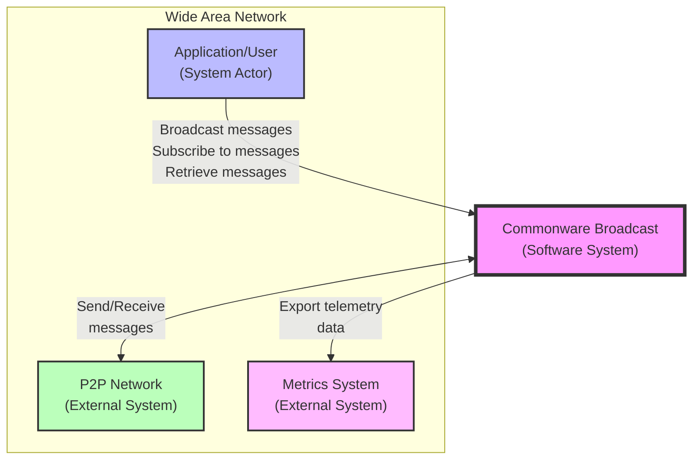

### External Actors

- **Application/User**: Systems or applications that use the broadcast library
- **P2P Network**: The underlying peer-to-peer network infrastructure
- **Metrics System**: External monitoring and observability systems (e.g., Prometheus)

---

## C4 Level 2: Container

The container diagram shows the high-level technical building blocks within the broadcast system.

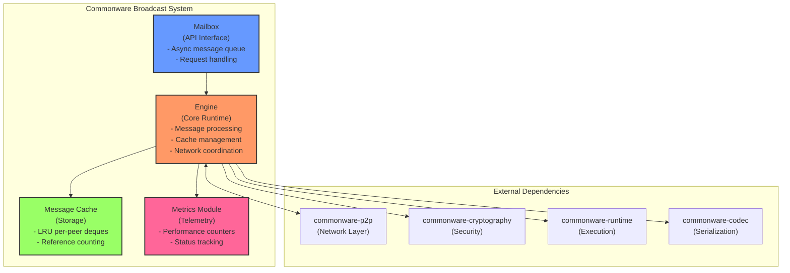

### Container Descriptions

- **Engine**: Core processing unit that orchestrates all operations
- **Mailbox**: Public API interface for external communication
- **Message Cache**: Sophisticated storage system with LRU eviction
- **Metrics Module**: Telemetry and monitoring subsystem

---

## C4 Level 3: Component

The component diagram shows the internal structure of the Engine container and its key components.

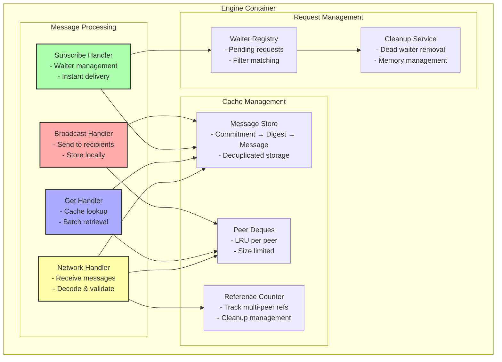

### Component Interactions

- **Message Handlers**: Process different types of requests
- **Cache Components**: Manage message storage and eviction
- **Request Management**: Track pending requests and clean up resources

---

## C4 Level 4: Code

The code-level diagram shows the detailed class/struct relationships and key data structures.

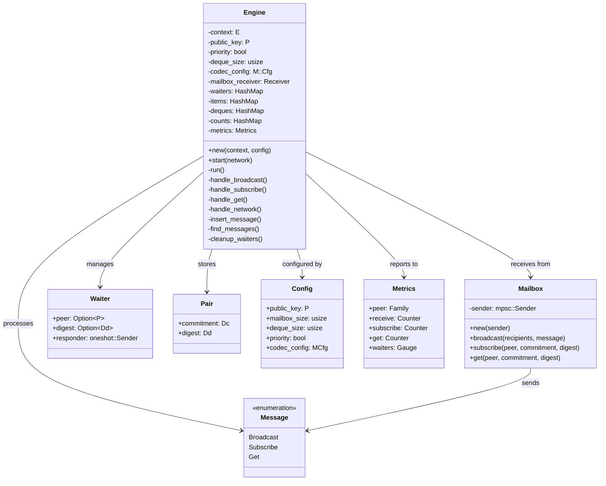

### Key Data Structures

#### Message Storage Structure

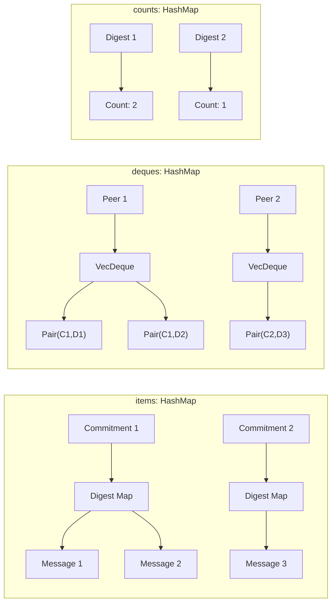

---

## Critical Process Flows

### 1. Message Broadcast Flow

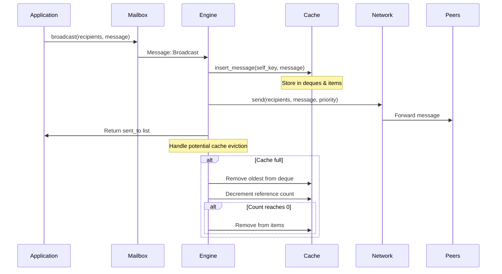

### 2. Message Subscribe Flow

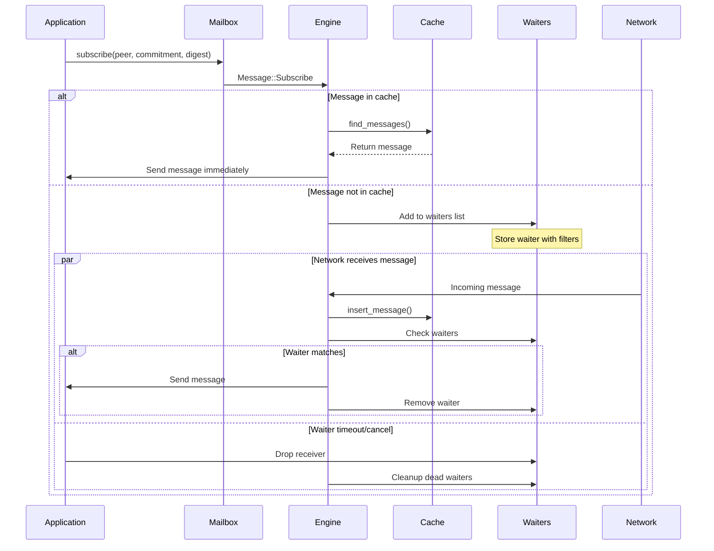

### 3. Message Retrieval (Get) Flow

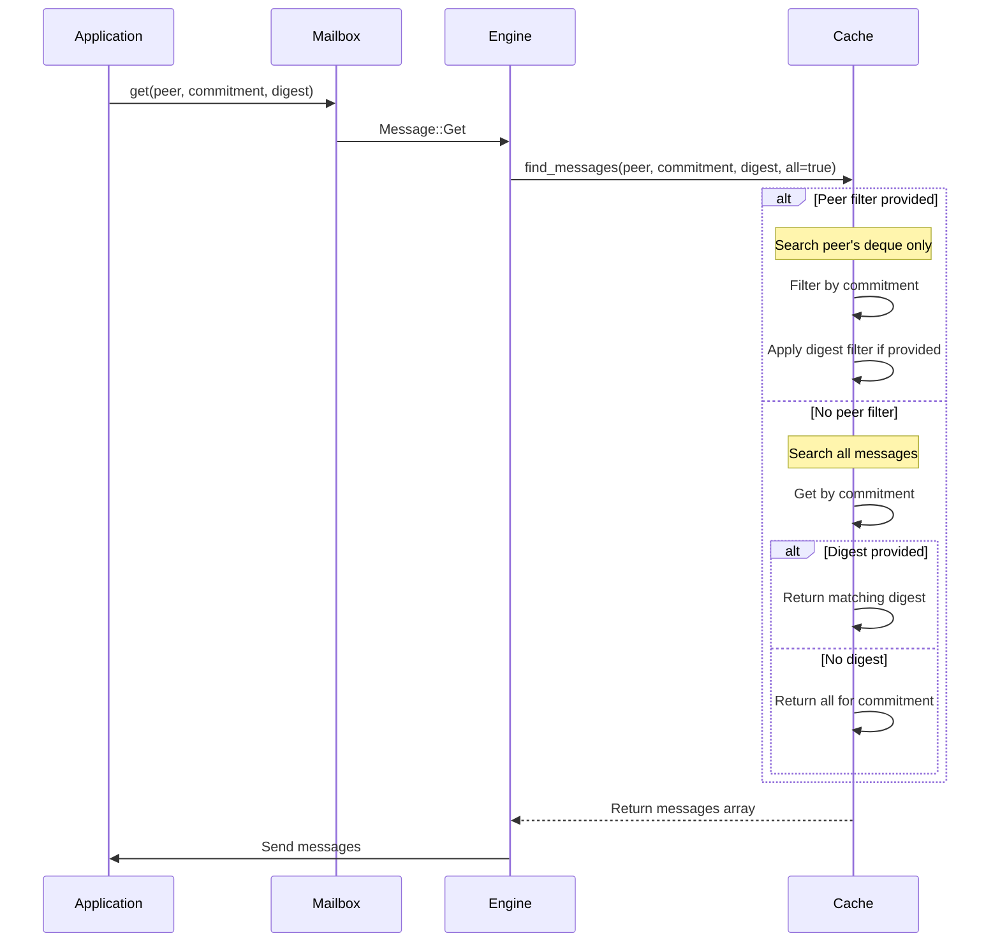

### 4. Network Message Reception Flow

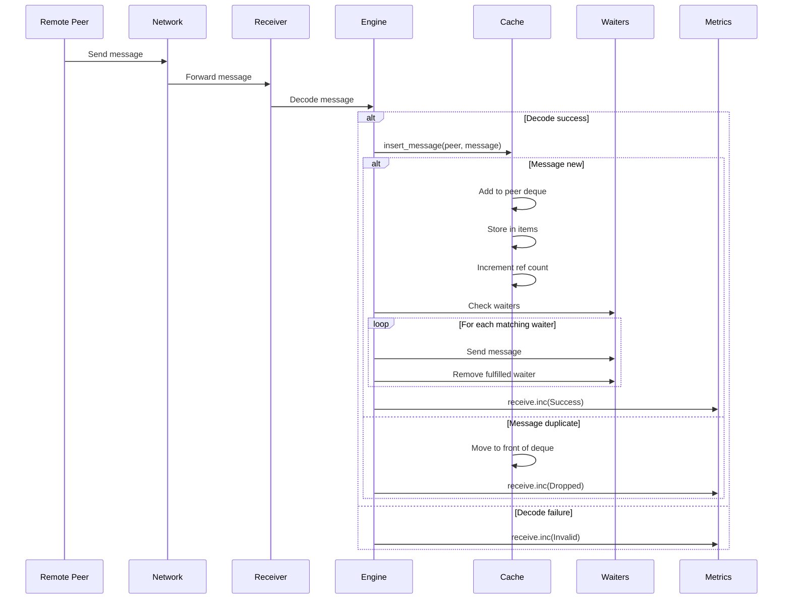

### 5. Cache Eviction Flow

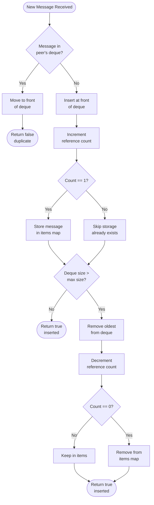

---

## Data Models

### Core Types

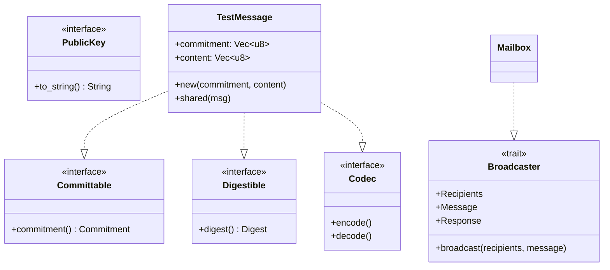

### Message Type Hierarchy

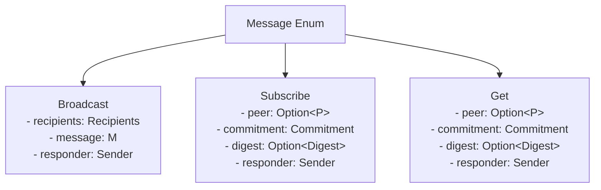

### Recipients Model

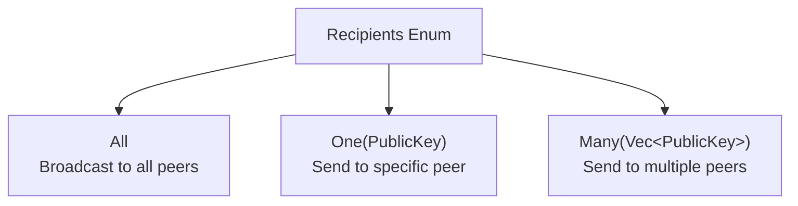

---

## Performance Characteristics

### Cache Complexity

| Operation          | Time Complexity           | Space Complexity  |
| ------------------ | ------------------------- | ----------------- |
| Insert Message     | O(1) amortized            | O(1)              |
| Find by Commitment | O(1)                      | -                 |
| Find by Peer       | O(n) where n = deque_size | -                 |
| Eviction           | O(1)                      | -                 |
| Reference Counting | O(1)                      | O(unique_digests) |

### Network Characteristics

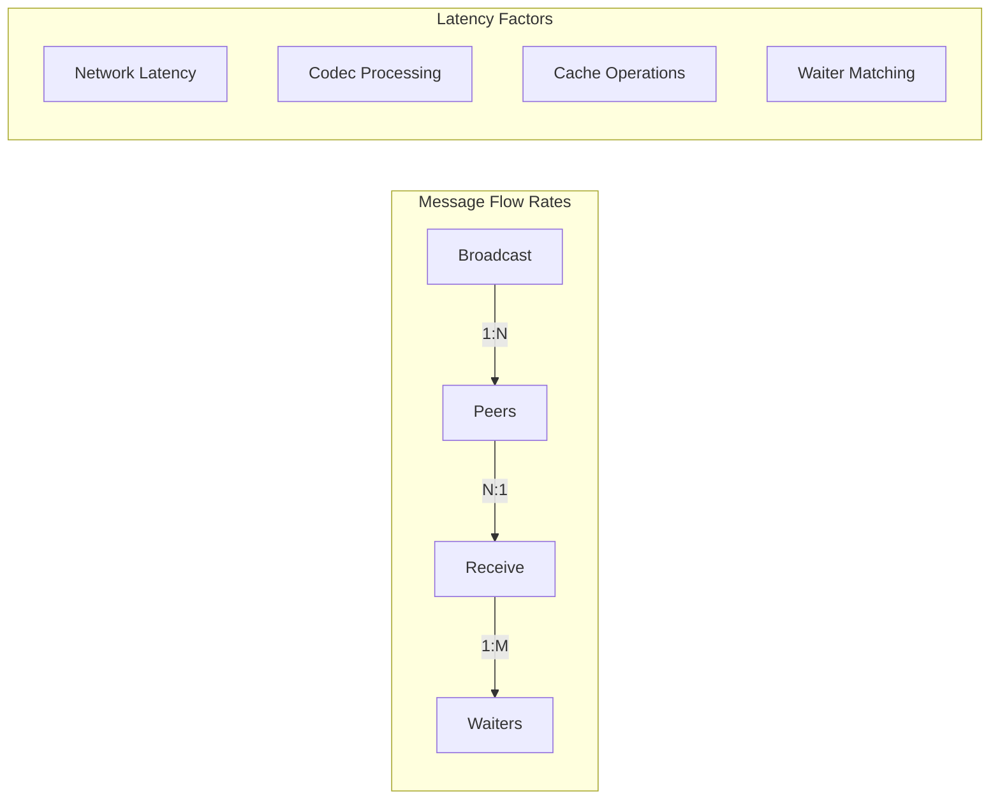

---

## Configuration Parameters

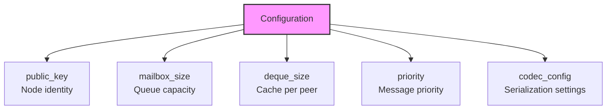

### Tuning Guidelines

1. **mailbox_size**: Set based on expected message rate and processing capacity
2. **deque_size**: Balance between memory usage and cache hit rate
3. **priority**: Enable for time-sensitive broadcasts
4. **codec_config**: Configure based on message size and complexity

---

## Metrics and Observability

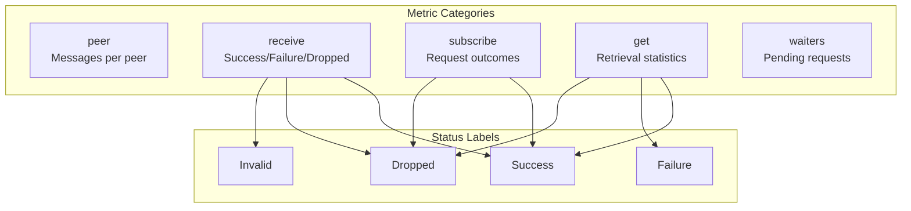

---

## Error Handling

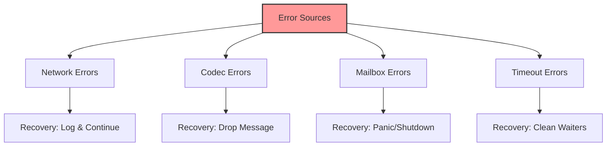

---

## Testing Architecture

The codebase includes comprehensive tests demonstrating:

1. **Basic Operations**: Broadcast, subscribe, get
2. **Cache Management**: Eviction, multi-peer references
3. **Network Conditions**: Packet loss, selective recipients
4. **Edge Cases**: Self-retrieval, digest filtering
5. **Performance**: Cache efficiency, waiter cleanup

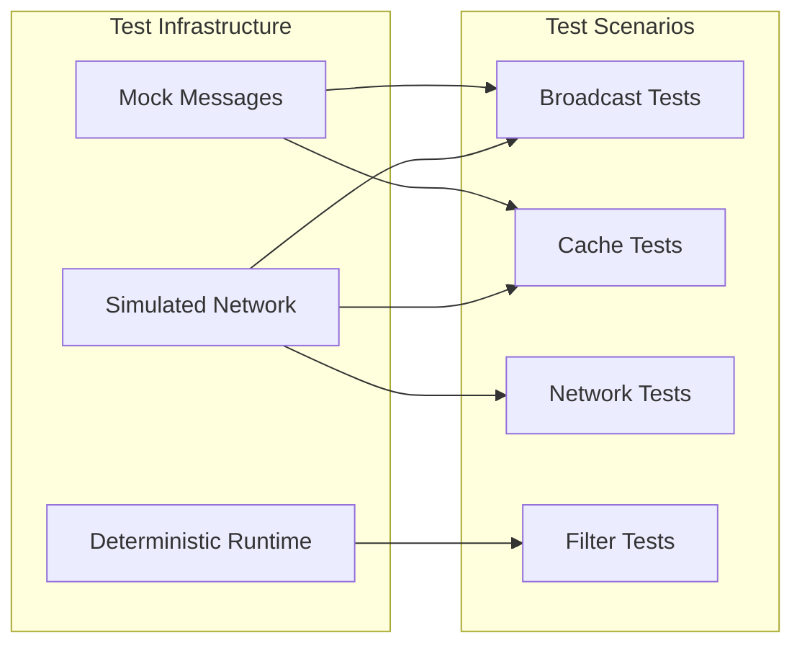

---

## Summary

The `commonware-broadcast` system implements a sophisticated peer-to-peer message broadcasting system with:

- **Efficient Caching**: LRU per-peer with reference counting
- **Flexible Filtering**: By peer, commitment, and digest
- **Async Operations**: Non-blocking throughout
- **Robust Error Handling**: Graceful degradation
- **Comprehensive Metrics**: Full observability

The architecture follows clean separation of concerns with clear boundaries between network interaction, cache management, and request handling, making it suitable for distributed systems requiring reliable message dissemination.
