# Ordered Broadcast System - C4 Model Architecture Documentation

## Table of Contents

1. [Level 1: System Context](#level-1-system-context)
2. [Level 2: Container Diagram](#level-2-container-diagram)
3. [Level 3: Component Diagrams](#level-3-component-diagrams)
4. [Level 4: Code/Class Diagrams](#level-4-code-diagrams)
5. [Dynamic Flow Diagrams](#dynamic-flow-diagrams)

---

## Level 1: System Context

### Overview

The Ordered Broadcast System provides Byzantine Fault Tolerant consensus through reliable, ordered message broadcasting with cryptographic proof of availability.

### Context Diagram

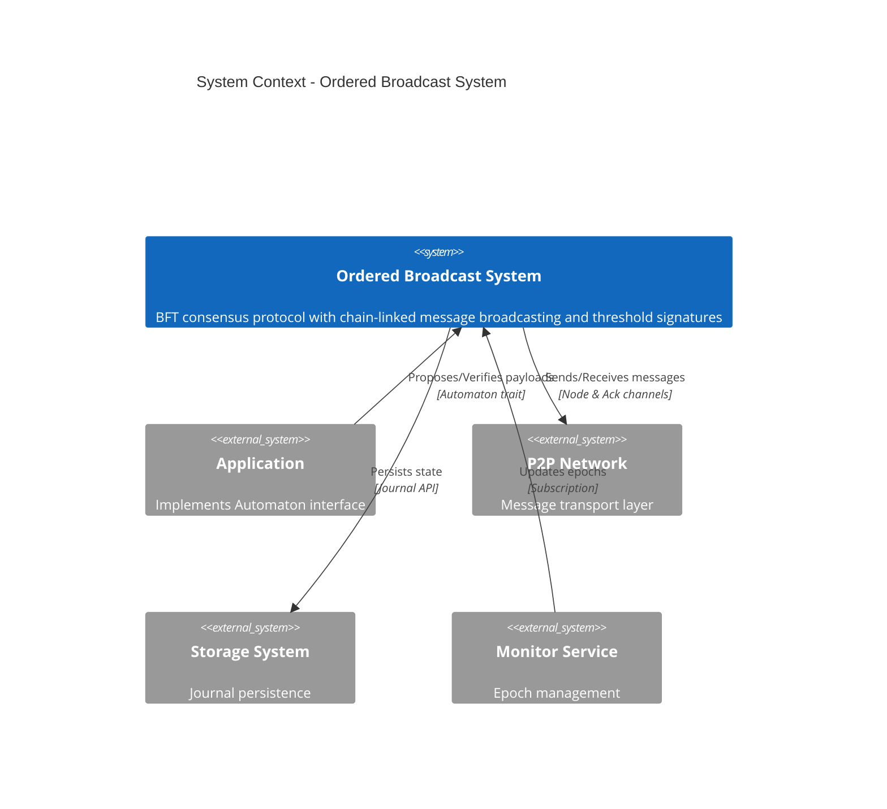
```mermaid
C4Context
    title System Context - Ordered Broadcast System

    System(obs, "Ordered Broadcast System", "BFT consensus protocol with chain-linked message broadcasting and threshold signatures")

    System_Ext(app, "Application", "Implements Automaton interface")
    System_Ext(p2p, "P2P Network", "Message transport layer")
    System_Ext(storage, "Storage System", "Journal persistence")
    System_Ext(monitor, "Monitor Service", "Epoch management")

    Rel(app, obs, "Proposes/Verifies payloads", "Automaton trait")
    Rel(obs, p2p, "Sends/Receives messages", "Node & Ack channels")
    Rel(obs, storage, "Persists state", "Journal API")
    Rel(monitor, obs, "Updates epochs", "Subscription")

    UpdateLayoutConfig($c4ShapeInRow="3", $c4BoundaryInRow="1")
```

---

## Level 2: Container Diagram

### Container Structure

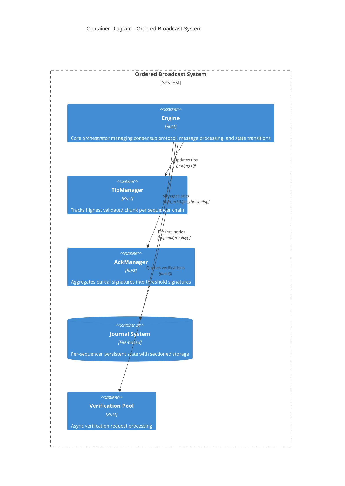
```mermaid
C4Container
    title Container Diagram - Ordered Broadcast System

    System_Boundary(obs, "Ordered Broadcast System") {
        Container(engine, "Engine", "Rust", "Core orchestrator managing consensus protocol, message processing, and state transitions")

        Container(tip_mgr, "TipManager", "Rust", "Tracks highest validated chunk per sequencer chain")

        Container(ack_mgr, "AckManager", "Rust", "Aggregates partial signatures into threshold signatures")

        ContainerDb(journal, "Journal System", "File-based", "Per-sequencer persistent state with sectioned storage")

        Container(verify_pool, "Verification Pool", "Rust", "Async verification request processing")

        Rel(engine, tip_mgr, "Updates tips", "put()/get()")
        Rel(engine, ack_mgr, "Manages acks", "add_ack()/get_threshold()")
        Rel(engine, journal, "Persists nodes", "append()/replay()")
        Rel(engine, verify_pool, "Queues verifications", "push()")
    }

    UpdateLayoutConfig($c4ShapeInRow="2", $c4BoundaryInRow="1")
```

---

## Level 3: Component Diagrams

### 3.1 Engine Internal Components

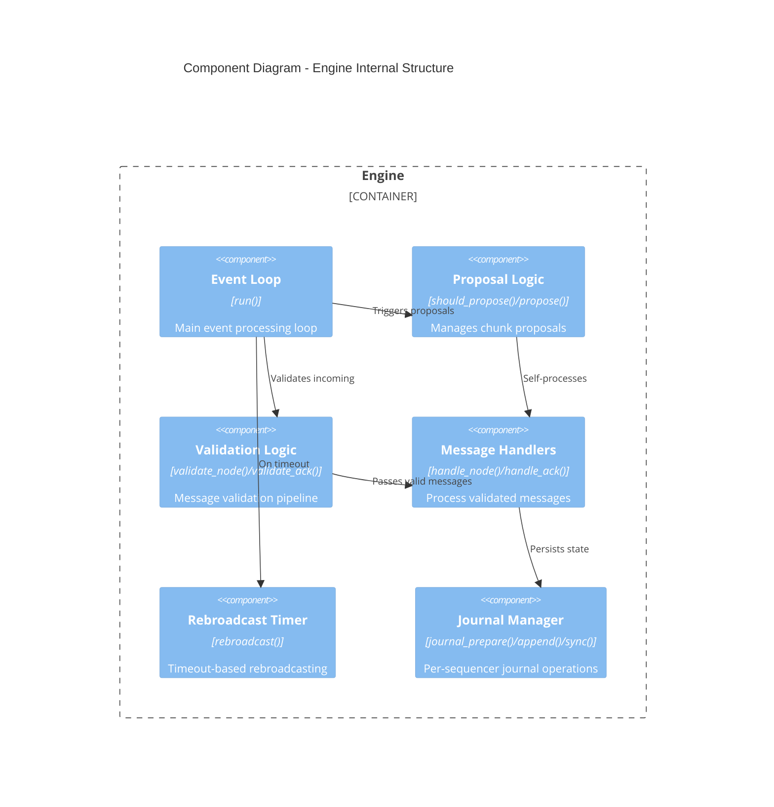
```mermaid
C4Component
    title Component Diagram - Engine Internal Structure

    Container_Boundary(engine, "Engine") {
        Component(event_loop, "Event Loop", "run()", "Main event processing loop")
        Component(proposer, "Proposal Logic", "should_propose()/propose()", "Manages chunk proposals")
        Component(validator, "Validation Logic", "validate_node()/validate_ack()", "Message validation pipeline")
        Component(handler, "Message Handlers", "handle_node()/handle_ack()", "Process validated messages")
        Component(rebroadcaster, "Rebroadcast Timer", "rebroadcast()", "Timeout-based rebroadcasting")
        Component(journal_mgr, "Journal Manager", "journal_prepare()/append()/sync()", "Per-sequencer journal operations")

        Rel(event_loop, proposer, "Triggers proposals")
        Rel(event_loop, validator, "Validates incoming")
        Rel(validator, handler, "Passes valid messages")
        Rel(handler, journal_mgr, "Persists state")
        Rel(event_loop, rebroadcaster, "On timeout")
        Rel(proposer, handler, "Self-processes")
    }

    UpdateLayoutConfig($c4ShapeInRow="3", $c4BoundaryInRow="1")
```

### 3.2 State Management Components

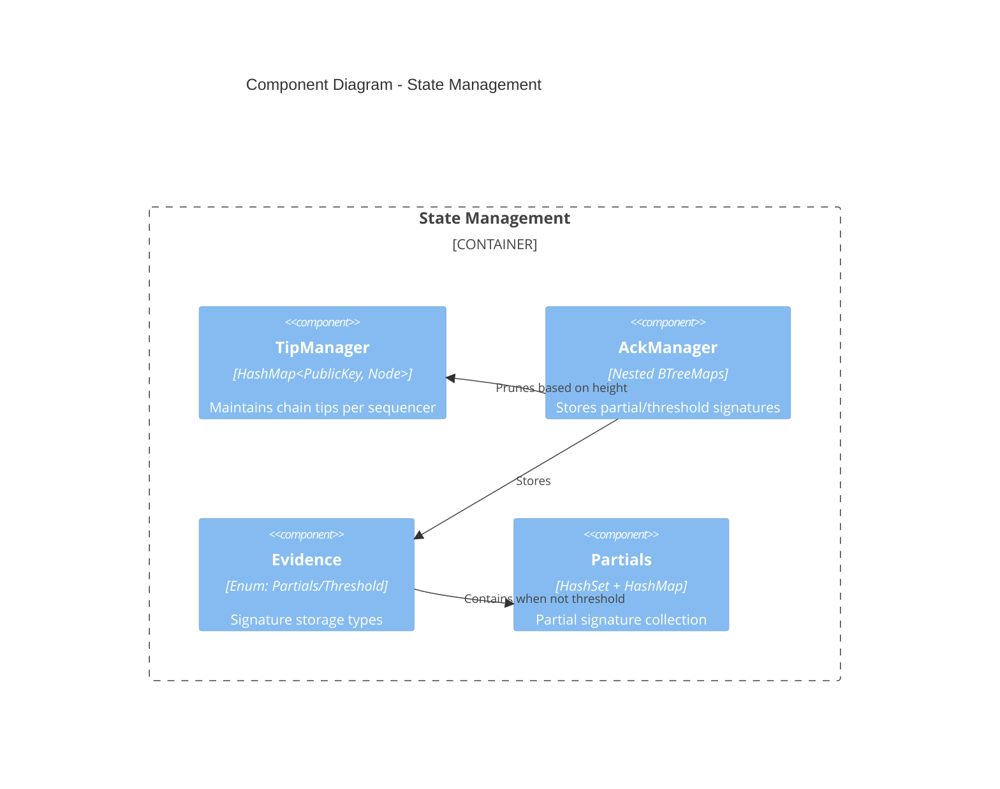
```mermaid
C4Component
    title Component Diagram - State Management

    Container_Boundary(state, "State Management") {
        Component(tip_mgr, "TipManager", "HashMap<PublicKey, Node>", "Maintains chain tips per sequencer")
        Component(ack_mgr, "AckManager", "Nested BTreeMaps", "Stores partial/threshold signatures")
        Component(evidence, "Evidence", "Enum: Partials/Threshold", "Signature storage types")
        Component(partials, "Partials", "HashSet + HashMap", "Partial signature collection")

        Rel(ack_mgr, evidence, "Stores")
        Rel(evidence, partials, "Contains when not threshold")
        Rel(ack_mgr, tip_mgr, "Prunes based on height")
    }

    UpdateLayoutConfig($c4ShapeInRow="2", $c4BoundaryInRow="1")
```

### 3.3 Message Processing Pipeline

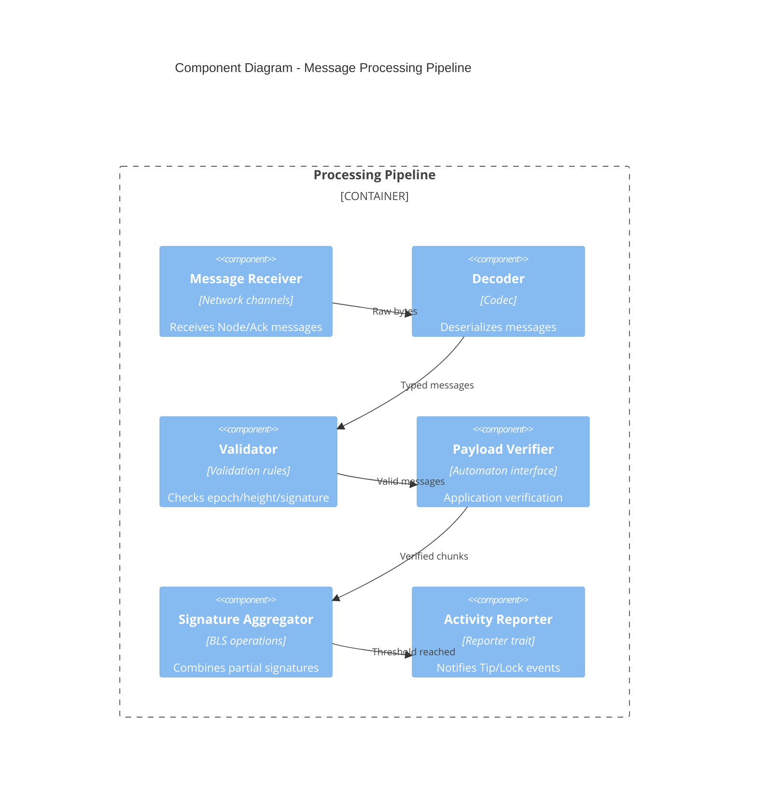
```mermaid
C4Component
    title Component Diagram - Message Processing Pipeline

    Container_Boundary(pipeline, "Processing Pipeline") {
        Component(receiver, "Message Receiver", "Network channels", "Receives Node/Ack messages")
        Component(decoder, "Decoder", "Codec", "Deserializes messages")
        Component(validator, "Validator", "Validation rules", "Checks epoch/height/signature")
        Component(verifier, "Payload Verifier", "Automaton interface", "Application verification")
        Component(aggregator, "Signature Aggregator", "BLS operations", "Combines partial signatures")
        Component(reporter, "Activity Reporter", "Reporter trait", "Notifies Tip/Lock events")

        Rel(receiver, decoder, "Raw bytes")
        Rel(decoder, validator, "Typed messages")
        Rel(validator, verifier, "Valid messages")
        Rel(verifier, aggregator, "Verified chunks")
        Rel(aggregator, reporter, "Threshold reached")
    }

    UpdateLayoutConfig($c4ShapeInRow="3", $c4BoundaryInRow="1")
```

---

## Level 4: Code Diagrams

### 4.1 Core Message Types

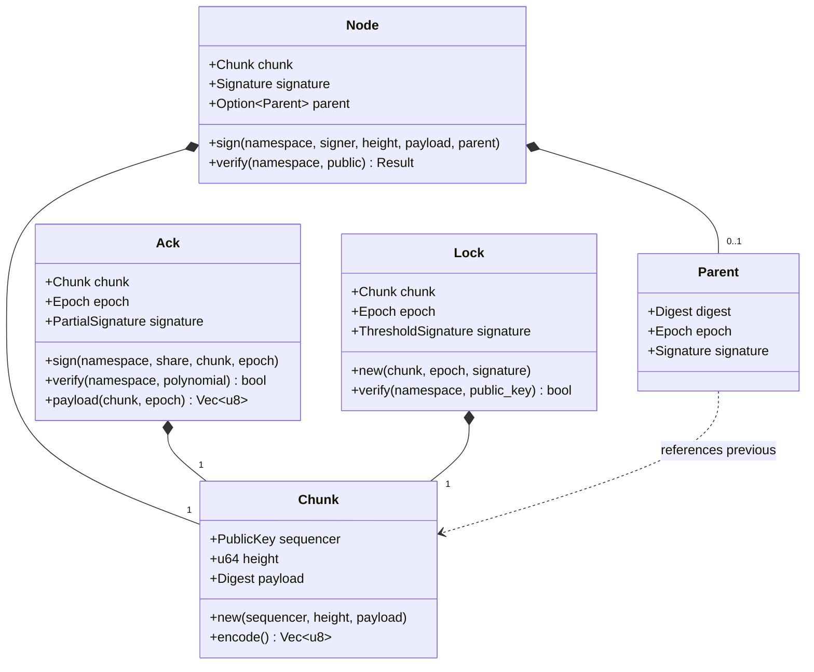
```mermaid
classDiagram
    class Chunk {
        +PublicKey sequencer
        +u64 height
        +Digest payload
        +new(sequencer, height, payload)
        +encode() Vec~u8~
    }

    class Parent {
        +Digest digest
        +Epoch epoch
        +Signature signature
    }

    class Node {
        +Chunk chunk
        +Signature signature
        +Option~Parent~ parent
        +sign(namespace, signer, height, payload, parent)
        +verify(namespace, public) Result
    }

    class Ack {
        +Chunk chunk
        +Epoch epoch
        +PartialSignature signature
        +sign(namespace, share, chunk, epoch)
        +verify(namespace, polynomial) bool
        +payload(chunk, epoch) Vec~u8~
    }

    class Lock {
        +Chunk chunk
        +Epoch epoch
        +ThresholdSignature signature
        +new(chunk, epoch, signature)
        +verify(namespace, public_key) bool
    }

    Node *-- "1" Chunk
    Node *-- "0..1" Parent
    Ack *-- "1" Chunk
    Lock *-- "1" Chunk
    Parent ..> Chunk : references previous
```

### 4.2 Engine State Management

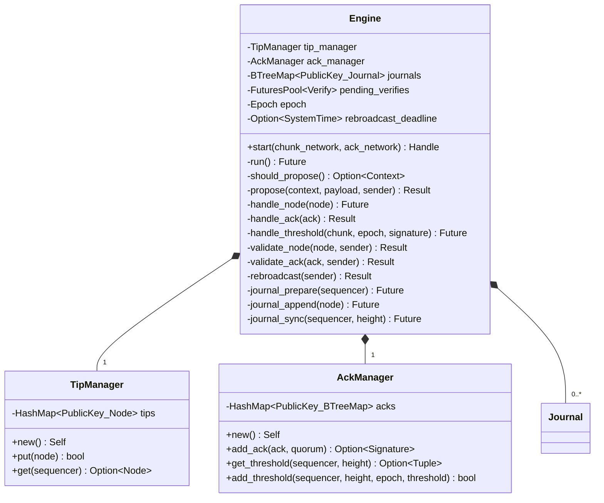
```mermaid
classDiagram
    class Engine {
        -TipManager tip_manager
        -AckManager ack_manager
        -BTreeMap~PublicKey_Journal~ journals
        -FuturesPool~Verify~ pending_verifies
        -Epoch epoch
        -Option~SystemTime~ rebroadcast_deadline

        +start(chunk_network, ack_network) Handle
        -run() Future
        -should_propose() Option~Context~
        -propose(context, payload, sender) Result
        -handle_node(node) Future
        -handle_ack(ack) Result
        -handle_threshold(chunk, epoch, signature) Future
        -validate_node(node, sender) Result
        -validate_ack(ack, sender) Result
        -rebroadcast(sender) Result
        -journal_prepare(sequencer) Future
        -journal_append(node) Future
        -journal_sync(sequencer, height) Future
    }

    class TipManager {
        -HashMap~PublicKey_Node~ tips
        +new() Self
        +put(node) bool
        +get(sequencer) Option~Node~
    }

    class AckManager {
        -HashMap~PublicKey_BTreeMap~ acks
        +new() Self
        +add_ack(ack, quorum) Option~Signature~
        +get_threshold(sequencer, height) Option~Tuple~
        +add_threshold(sequencer, height, epoch, threshold) bool
    }

    Engine *-- "1" TipManager
    Engine *-- "1" AckManager
    Engine *-- "0..*" Journal
```

### 4.3 Signature Management

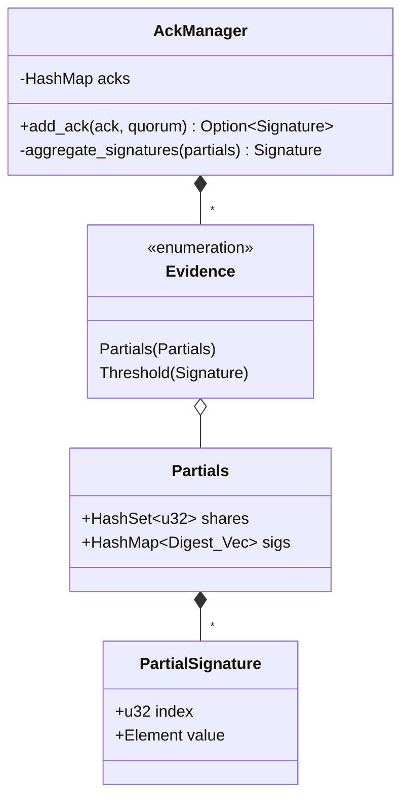
```mermaid
classDiagram
    class Evidence {
        <<enumeration>>
        Partials(Partials)
        Threshold(Signature)
    }

    class Partials {
        +HashSet~u32~ shares
        +HashMap~Digest_Vec~ sigs
    }

    class PartialSignature {
        +u32 index
        +Element value
    }

    class AckManager {
        -HashMap acks
        +add_ack(ack, quorum) Option~Signature~
        -aggregate_signatures(partials) Signature
    }

    Evidence o-- Partials
    Partials *-- "*" PartialSignature
    AckManager *-- "*" Evidence
```

### 4.4 Verification Pipeline

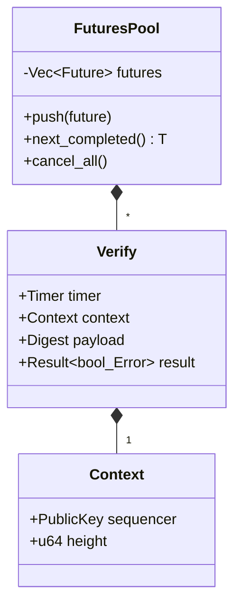
```mermaid
classDiagram
    class Verify {
        +Timer timer
        +Context context
        +Digest payload
        +Result~bool_Error~ result
    }

    class FuturesPool {
        -Vec~Future~ futures
        +push(future)
        +next_completed() T
        +cancel_all()
    }

    class Context {
        +PublicKey sequencer
        +u64 height
    }

    FuturesPool *-- "*" Verify
    Verify *-- "1" Context
```

---

## Dynamic Flow Diagrams

### 5.1 Chunk Proposal and Broadcasting

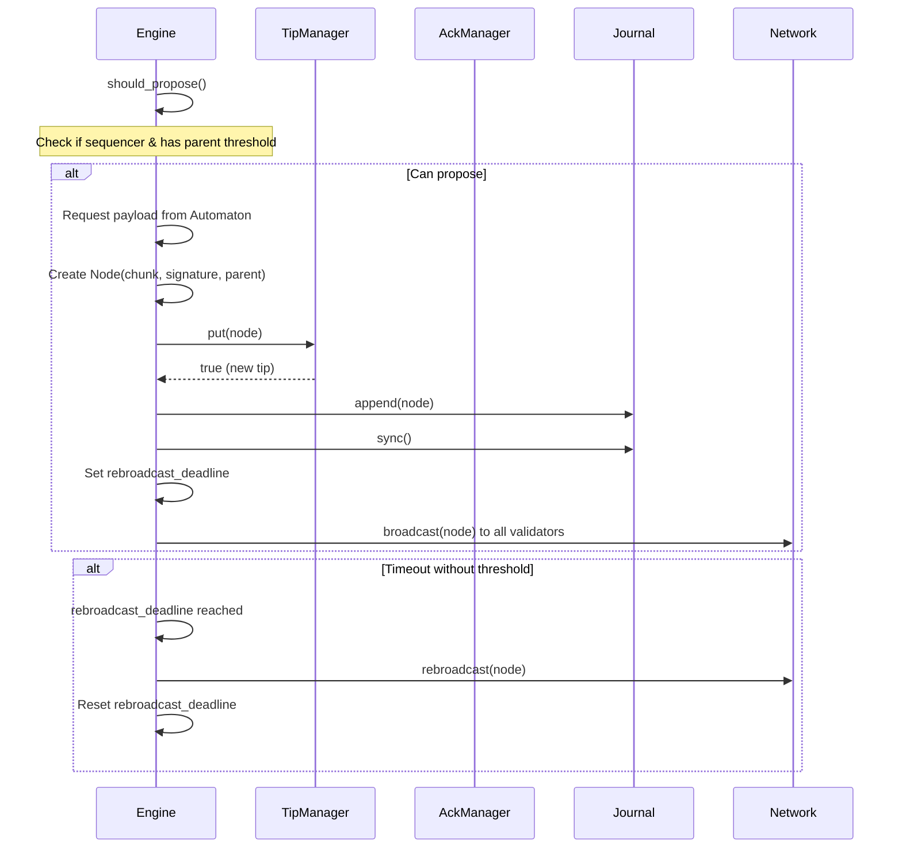
```mermaid
sequenceDiagram
    participant Engine
    participant TipManager
    participant AckManager
    participant Journal
    participant Network

    Engine->>Engine: should_propose()
    Note over Engine: Check if sequencer & has parent threshold

    alt Can propose
        Engine->>Engine: Request payload from Automaton
        Engine->>Engine: Create Node(chunk, signature, parent)
        Engine->>TipManager: put(node)
        TipManager-->>Engine: true (new tip)
        Engine->>Journal: append(node)
        Engine->>Journal: sync()
        Engine->>Engine: Set rebroadcast_deadline
        Engine->>Network: broadcast(node) to all validators
    end

    alt Timeout without threshold
        Engine->>Engine: rebroadcast_deadline reached
        Engine->>Network: rebroadcast(node)
        Engine->>Engine: Reset rebroadcast_deadline
    end
```

### 5.2 Node Reception and Validation

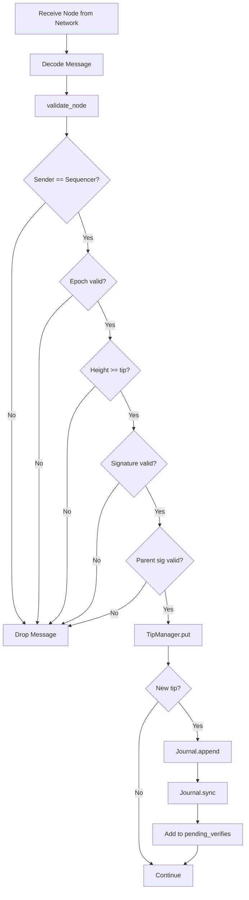
```mermaid
flowchart TD
    Receive[Receive Node from Network]
    Decode[Decode Message]

    ValidateNode[validate_node]
    CheckSender{Sender == Sequencer?}
    CheckEpoch{Epoch valid?}
    CheckHeight{Height >= tip?}
    VerifySig{Signature valid?}
    VerifyParent{Parent sig valid?}

    UpdateTip[TipManager.put]
    IsNew{New tip?}

    AppendJournal[Journal.append]
    SyncJournal[Journal.sync]

    QueueVerify[Add to pending_verifies]

    Drop[Drop Message]
    Done[Continue]

    Receive --> Decode
    Decode --> ValidateNode
    ValidateNode --> CheckSender
    CheckSender -->|No| Drop
    CheckSender -->|Yes| CheckEpoch
    CheckEpoch -->|No| Drop
    CheckEpoch -->|Yes| CheckHeight
    CheckHeight -->|No| Drop
    CheckHeight -->|Yes| VerifySig
    VerifySig -->|No| Drop
    VerifySig -->|Yes| VerifyParent
    VerifyParent -->|No| Drop
    VerifyParent -->|Yes| UpdateTip

    UpdateTip --> IsNew
    IsNew -->|No| Done
    IsNew -->|Yes| AppendJournal
    AppendJournal --> SyncJournal
    SyncJournal --> QueueVerify
    QueueVerify --> Done
```

### 5.3 Acknowledgment Processing

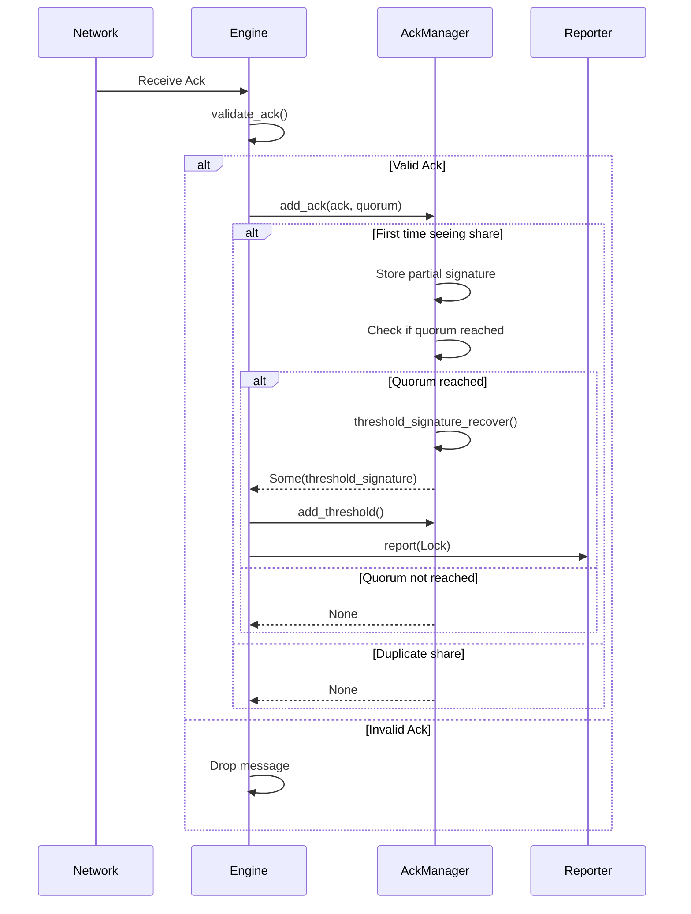
```mermaid
sequenceDiagram
    participant Network
    participant Engine
    participant AckManager
    participant Reporter

    Network->>Engine: Receive Ack
    Engine->>Engine: validate_ack()

    alt Valid Ack
        Engine->>AckManager: add_ack(ack, quorum)

        alt First time seeing share
            AckManager->>AckManager: Store partial signature
            AckManager->>AckManager: Check if quorum reached

            alt Quorum reached
                AckManager->>AckManager: threshold_signature_recover()
                AckManager-->>Engine: Some(threshold_signature)
                Engine->>AckManager: add_threshold()
                Engine->>Reporter: report(Lock)
            else Quorum not reached
                AckManager-->>Engine: None
            end
        else Duplicate share
            AckManager-->>Engine: None
        end
    else Invalid Ack
        Engine->>Engine: Drop message
    end
```

### 5.4 Threshold Signature Formation

```mermaid
flowchart TD
    Start[Add Ack to Manager]

    GetEvidence[Get evidence for sequencer/height/epoch]
    CheckType{Evidence type?}

    AlreadyThreshold[Return None<br/>Already have threshold]

    CheckShare{Share already seen?}
    InsertShare[Insert share index]
    AddPartial[Add partial signature]

    CheckQuorum{Quorum reached?}
    RemovePartials[Take partials from map]
    RecoverThreshold[threshold_signature_recover]
    StoreThreshold[Store threshold signature]

    ReturnNone[Return None]
    ReturnSig[Return Some(signature)]

    Start --> GetEvidence
    GetEvidence --> CheckType
    CheckType -->|Threshold| AlreadyThreshold
    CheckType -->|Partials| CheckShare

    CheckShare -->|Yes| ReturnNone
    CheckShare -->|No| InsertShare
    InsertShare --> AddPartial
    AddPartial --> CheckQuorum

    CheckQuorum -->|No| ReturnNone
    CheckQuorum -->|Yes| RemovePartials
    RemovePartials --> RecoverThreshold
    RecoverThreshold --> StoreThreshold
    StoreThreshold --> ReturnSig
```

### 5.5 State Recovery on Restart

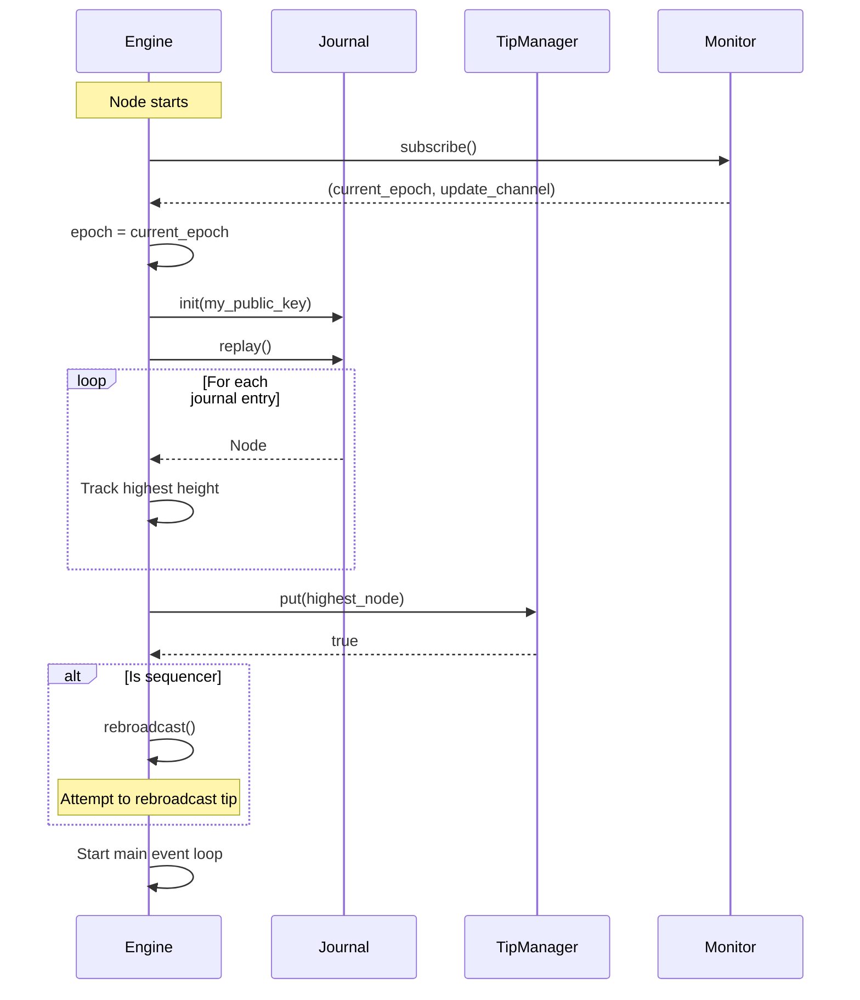
```mermaid
sequenceDiagram
    participant Engine
    participant Journal
    participant TipManager
    participant Monitor

    Note over Engine: Node starts

    Engine->>Monitor: subscribe()
    Monitor-->>Engine: (current_epoch, update_channel)
    Engine->>Engine: epoch = current_epoch

    Engine->>Journal: init(my_public_key)
    Engine->>Journal: replay()

    loop For each journal entry
        Journal-->>Engine: Node
        Engine->>Engine: Track highest height
    end

    Engine->>TipManager: put(highest_node)
    TipManager-->>Engine: true

    alt Is sequencer
        Engine->>Engine: rebroadcast()
        Note over Engine: Attempt to rebroadcast tip
    end

    Engine->>Engine: Start main event loop
```

### 5.6 Chain Progression

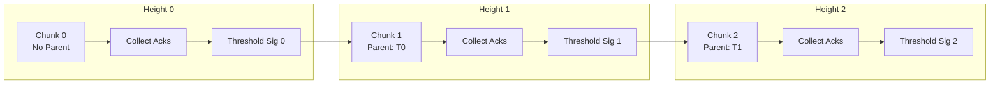
```mermaid
flowchart LR
    subgraph "Height 0"
        C0[Chunk 0<br/>No Parent]
        C0_Acks[Collect Acks]
        T0[Threshold Sig 0]
    end

    subgraph "Height 1"
        C1[Chunk 1<br/>Parent: T0]
        C1_Acks[Collect Acks]
        T1[Threshold Sig 1]
    end

    subgraph "Height 2"
        C2[Chunk 2<br/>Parent: T1]
        C2_Acks[Collect Acks]
        T2[Threshold Sig 2]
    end

    C0 --> C0_Acks
    C0_Acks --> T0
    T0 --> C1
    C1 --> C1_Acks
    C1_Acks --> T1
    T1 --> C2
    C2 --> C2_Acks
    C2_Acks --> T2
```

### 5.7 Pruning and Memory Management

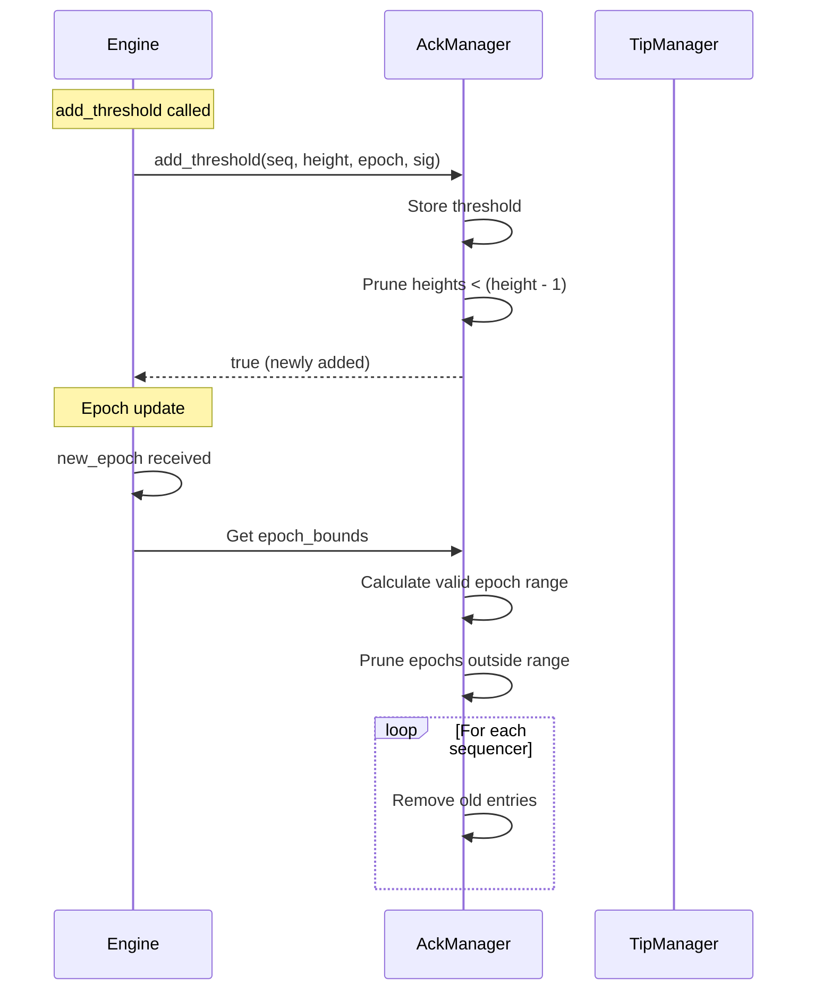
```mermaid
sequenceDiagram
    participant Engine
    participant AckManager
    participant TipManager

    Note over Engine: add_threshold called

    Engine->>AckManager: add_threshold(seq, height, epoch, sig)
    AckManager->>AckManager: Store threshold
    AckManager->>AckManager: Prune heights < (height - 1)
    AckManager-->>Engine: true (newly added)

    Note over Engine: Epoch update

    Engine->>Engine: new_epoch received
    Engine->>AckManager: Get epoch_bounds
    AckManager->>AckManager: Calculate valid epoch range
    AckManager->>AckManager: Prune epochs outside range

    loop For each sequencer
        AckManager->>AckManager: Remove old entries
    end
```

### 5.8 Parallel Sequencer Chains

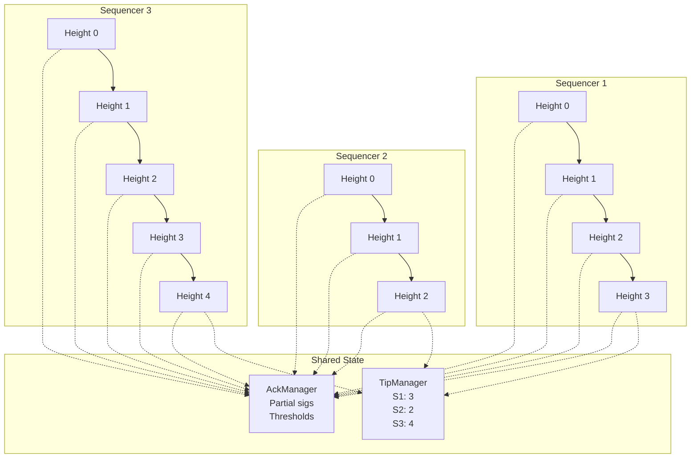
```mermaid
flowchart TD
    subgraph "Sequencer 1"
        S1_0[Height 0] --> S1_1[Height 1]
        S1_1 --> S1_2[Height 2]
        S1_2 --> S1_3[Height 3]
    end

    subgraph "Sequencer 2"
        S2_0[Height 0] --> S2_1[Height 1]
        S2_1 --> S2_2[Height 2]
    end

    subgraph "Sequencer 3"
        S3_0[Height 0] --> S3_1[Height 1]
        S3_1 --> S3_2[Height 2]
        S3_2 --> S3_3[Height 3]
        S3_3 --> S3_4[Height 4]
    end

    subgraph "Shared State"
        TM[TipManager<br/>S1: 3<br/>S2: 2<br/>S3: 4]
        AM[AckManager<br/>Partial sigs<br/>Thresholds]
    end

    S1_3 -.-> TM
    S2_2 -.-> TM
    S3_4 -.-> TM

    S1_0 & S1_1 & S1_2 & S1_3 -.-> AM
    S2_0 & S2_1 & S2_2 -.-> AM
    S3_0 & S3_1 & S3_2 & S3_3 & S3_4 -.-> AM
```

---

## Summary

The Ordered Broadcast System achieves Byzantine Fault Tolerance through:

1. **Chain Linking**: Each chunk includes proof of its parent, creating an immutable chain
2. **Threshold Signatures**: BLS aggregation enables efficient quorum verification
3. **State Management**: TipManager and AckManager maintain consensus state efficiently
4. **Persistence**: Per-sequencer journals enable crash recovery
5. **Parallel Chains**: Multiple sequencers operate independent chains simultaneously
6. **Pruning**: Automatic cleanup of old state maintains bounded memory usage

The architecture separates concerns cleanly:

- **Engine**: Orchestrates all operations
- **TipManager**: Tracks chain progress
- **AckManager**: Handles signature aggregation
- **Journal**: Provides persistence
- **Verification Pool**: Manages async verification

This design enables high throughput, fault tolerance, and efficient resource usage while maintaining strong consistency guarantees.
