# Consensus Module - Technical Documentation

## Overview

The `commonware-consensus` module provides production-ready Byzantine Fault Tolerant (BFT) consensus algorithms for ordering opaque messages in distributed systems. It offers multiple consensus implementations optimized for different use cases, from simple and fast agreement to threshold-based systems with embedded VRFs and succinct certificates.

**Status**: ALPHA - Not yet recommended for production use.

## Architecture Overview

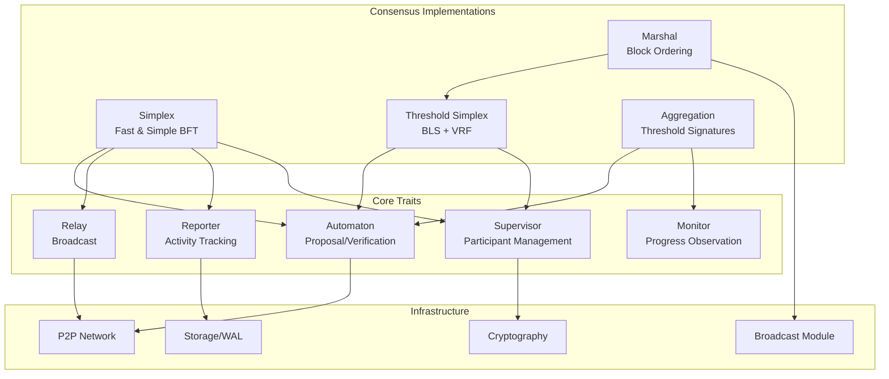

## Core Traits

### 1. Automaton

Drives consensus by proposing and verifying payloads:

```rust
pub trait Automaton: Clone + Send + 'static {
    type Context;
    type Digest: Digest;
    
    fn genesis(&mut self) -> impl Future<Output = Self::Digest> + Send;
    
    fn propose(&mut self, context: Self::Context) 
        -> impl Future<Output = oneshot::Receiver<Self::Digest>> + Send;
    
    fn verify(&mut self, context: Self::Context, payload: Self::Digest)
        -> impl Future<Output = oneshot::Receiver<bool>> + Send;
}
```

### 2. Supervisor

Manages active participants and leader selection:

```rust
pub trait Supervisor: Clone + Send + Sync + 'static {
    type Index;
    type PublicKey: PublicKey;
    
    fn leader(&self, index: Self::Index) -> Option<Self::PublicKey>;
    fn participants(&self, index: Self::Index) -> Option<&Vec<Self::PublicKey>>;
    fn is_participant(&self, index: Self::Index, candidate: &Self::PublicKey) -> Option<u32>;
}
```

## Consensus Implementations

## 1. Simplex Consensus

### Overview

Simple and fast BFT agreement with:
- **2 Network Hops** for block times
- **3 Network Hops** for finalization
- Optimal performance in partially synchronous settings

### Architecture

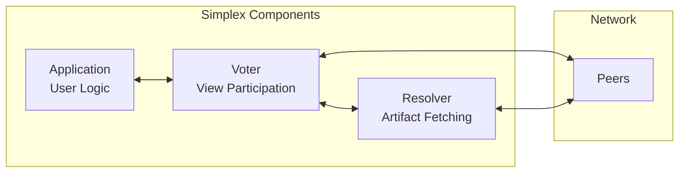

### Protocol Flow

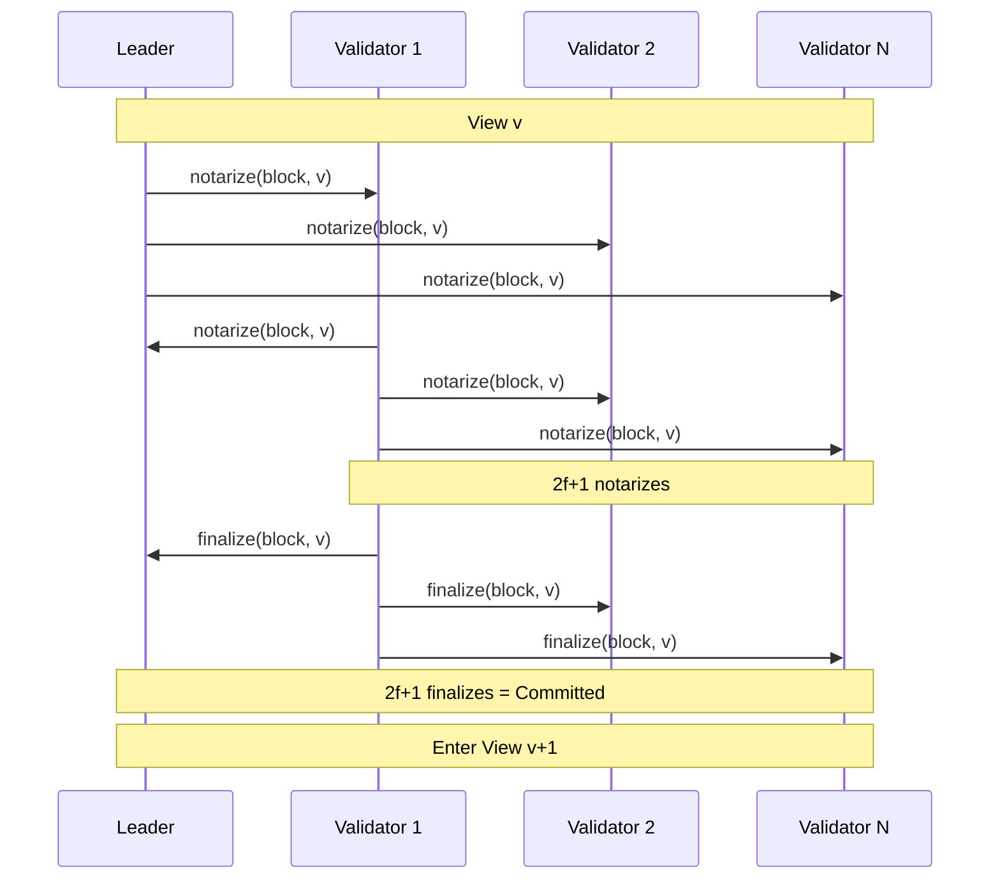

### State Machine

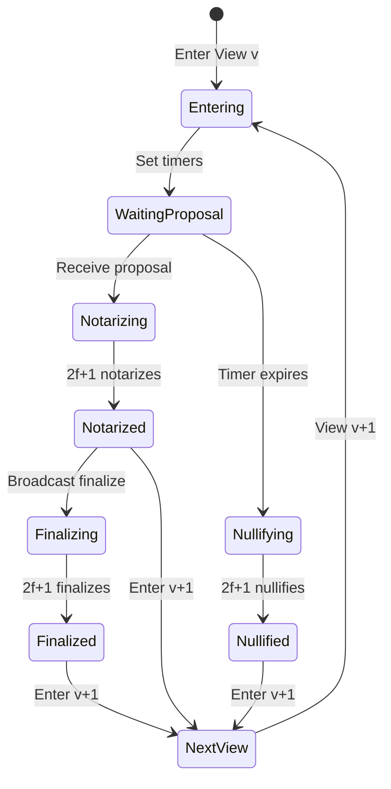

### Key Features

- **Fast Path**: 2 network hops for notarization
- **Optimal Finalization**: 3 network hops for finality
- **View Synchronization**: Automatic catch-up to latest view
- **Persistence**: WAL for crash recovery

## 2. Threshold Simplex

### Overview

Enhanced Simplex with threshold cryptography (BLS12-381):
- **Embedded VRF** for bias-resistant randomness
- **Succinct Certificates** verifiable with single public key
- **Lazy Verification** via batching
- **2f+1 of 3f+1** threshold quorum

### Architecture

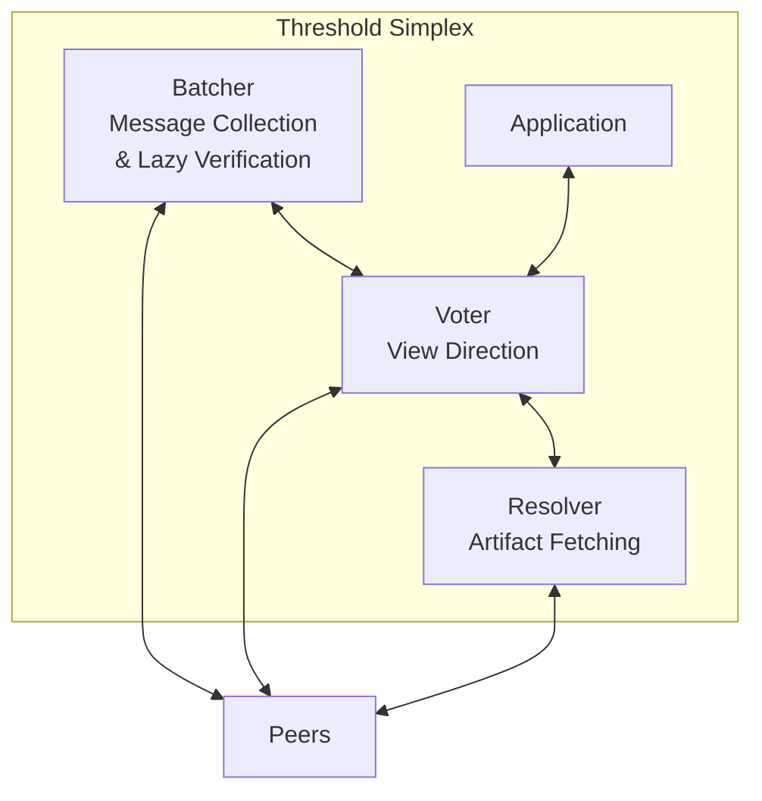

### Threshold Signature Flow

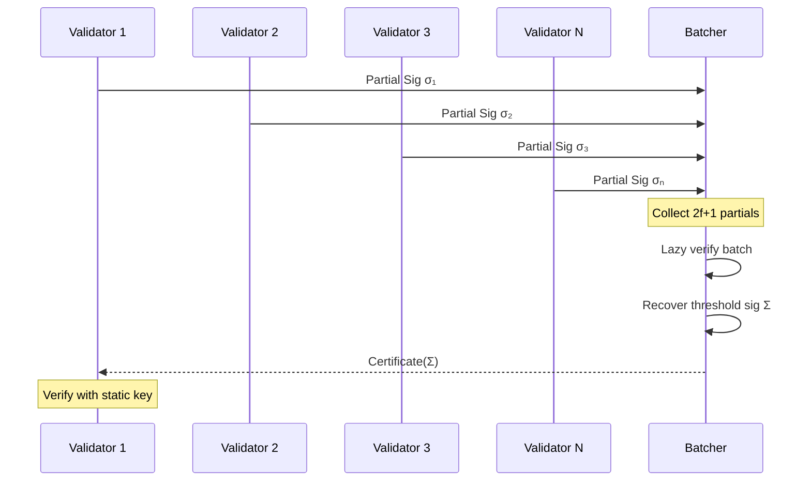

### VRF and Leader Selection

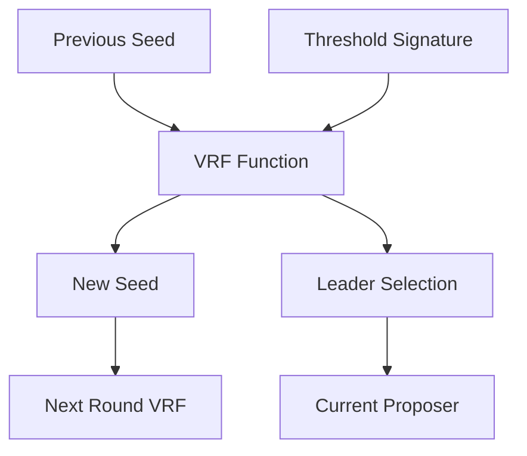

## 3. Aggregation Engine

### Overview

Recovers threshold signatures over externally synchronized sequences:
- **External Synchronization**: Works with opaque consensus
- **Threshold Recovery**: BLS signatures from validator sets
- **Dynamic Participation**: Handles validator set changes

### Architecture

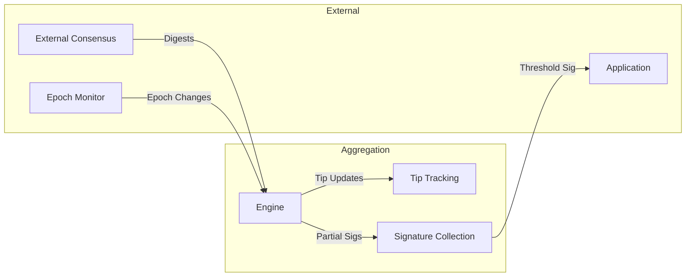

### Tip Advancement

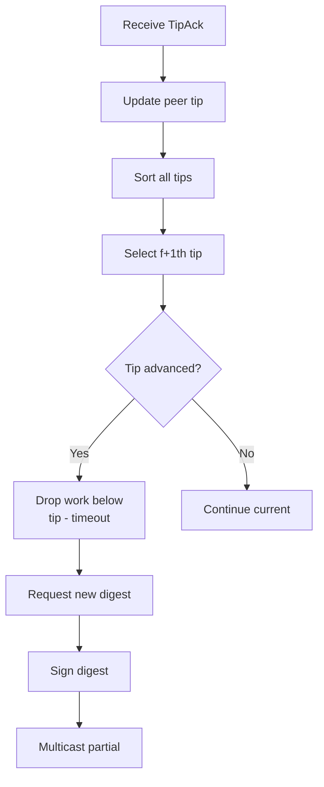

## 4. Marshal (Block Ordering)

### Overview

Ensures ordered delivery of finalized blocks:
- **Total Ordering**: Reconstructs block sequence
- **Backfill**: Requests missing blocks
- **At-Least-Once**: Guaranteed delivery

### Architecture

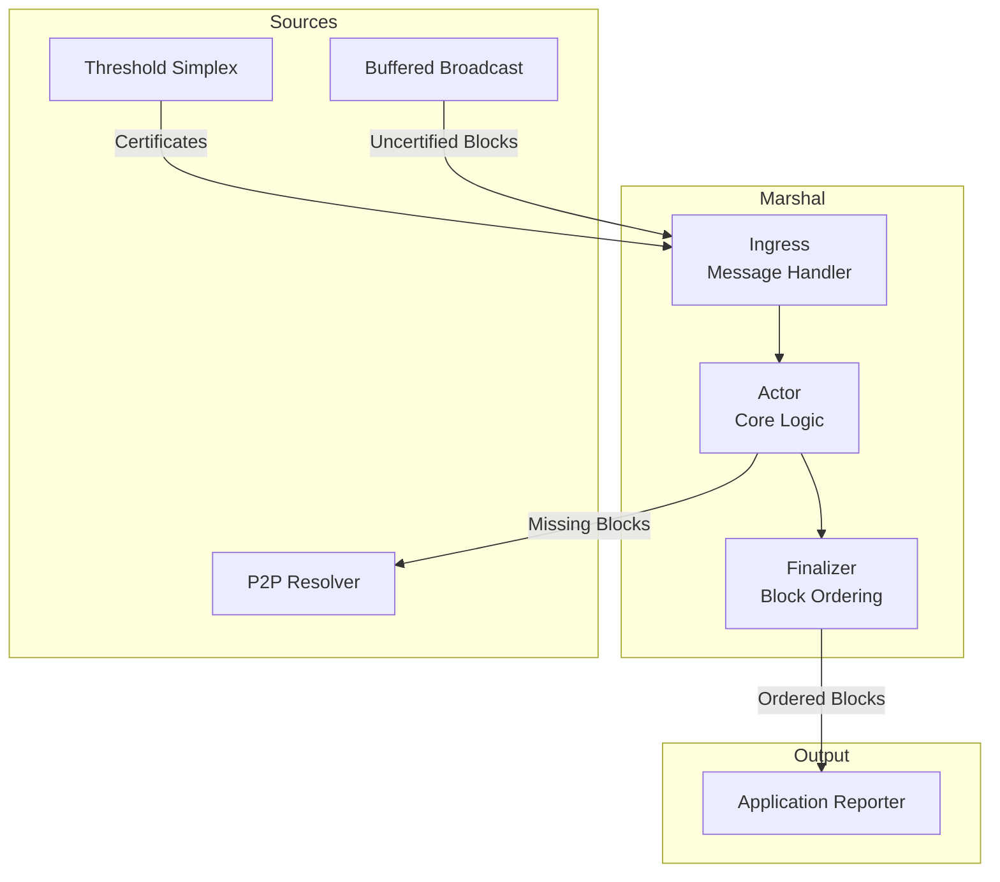

### Block Processing Flow

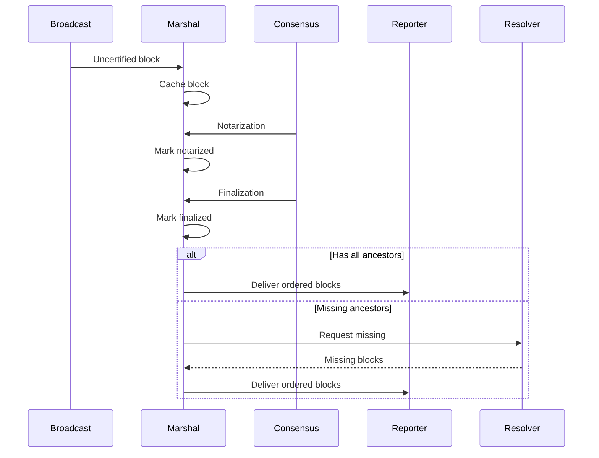

## Byzantine Fault Tolerance

### Threat Model

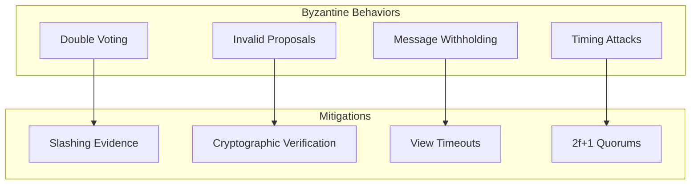

### Safety Properties

| Property | Guarantee | Mechanism |
|----------|-----------|-----------|
| Agreement | All honest nodes finalize same blocks | 2f+1 quorum requirement |
| Validity | Only valid blocks finalized | Verification before voting |
| Termination | Progress under partial synchrony | View timeouts and advancement |
| Integrity | No tampering with messages | Cryptographic signatures |

### Liveness Conditions

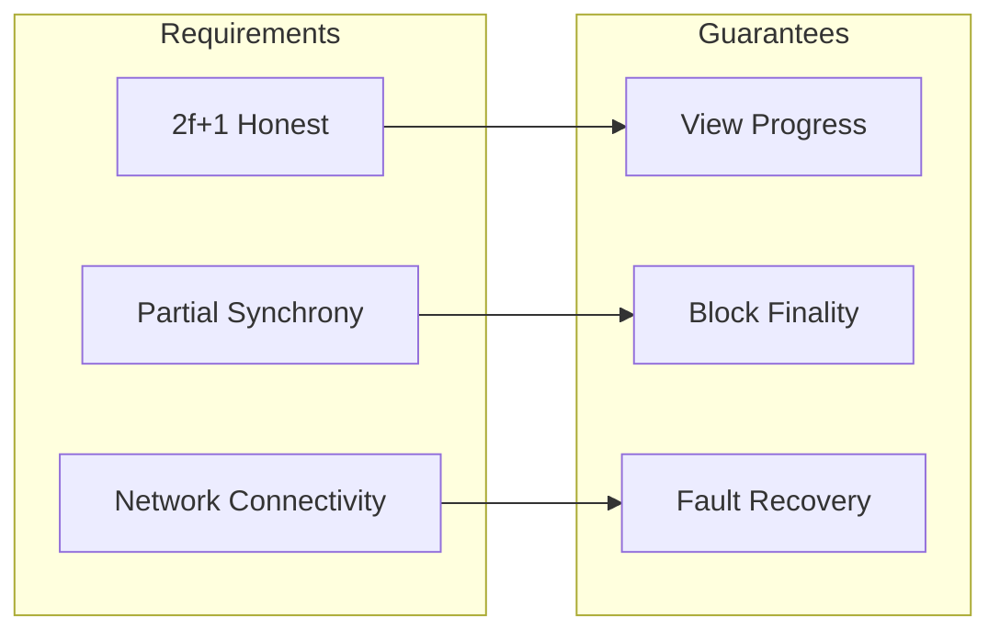

## Performance Characteristics

### Latency Analysis

| Operation | Simplex | Threshold Simplex | Network Hops |
|-----------|---------|-------------------|--------------|
| Notarization | 2Δ | 2Δ | 2 |
| Finalization | 3Δ | 3Δ | 3 |
| View Change | 2Δ | 2Δ | 2 |
| Certificate Verification | O(n) | O(1) | - |
| Signature Size | O(n) | O(1) | - |

### Message Complexity

```mermaid
graph LR
    subgraph "Per View"
        PROPOSE[1 Proposal]
        NOTARIZE[n Notarizes]
        FINALIZE[n Finalizes]
        NULLIFY[n Nullifies]
    end
    
    subgraph "Total"
        TOTAL[O(n) messages]
        SIZE[O(1) certificate size<br/>with threshold]
    end
    
    PROPOSE --> TOTAL
    NOTARIZE --> TOTAL
    FINALIZE --> TOTAL
    NULLIFY --> TOTAL
```

## Storage & Persistence

### WAL Design

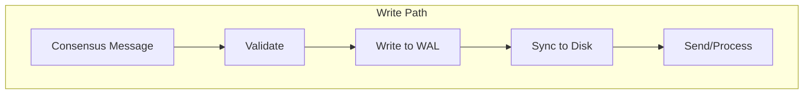

### Storage Types

| Component | Storage Type | Purpose | Retention |
|-----------|-------------|---------|-----------|
| WAL | Journal | Crash recovery | Until finalized |
| Notarizations | Prunable | View participation | Recent views |
| Finalizations | Immutable | Chain history | Permanent |
| Blocks | Immutable | Full blocks | Permanent |

## Configuration

### Simplex Configuration

```rust
Config {
    // Identity
    public_key: node_key,
    private_key: node_private,
    
    // Timing (Δ = expected network delay)
    delta: Duration::from_millis(200),
    
    // Leader timeout multiplier
    leader_timeout: 2,  // 2Δ
    advance_timeout: 3, // 3Δ
    
    // Inactivity threshold
    recent_activity: 10, // views
    
    // Storage
    journal_size: 1024 * 1024 * 100, // 100MB
}
```

### Threshold Simplex Configuration

```rust
Config {
    // Threshold crypto
    identity: group_public_key,
    polynomial: group_polynomial,
    share: validator_share,
    
    // Batching
    batch_size: 100,
    batch_timeout: Duration::from_millis(50),
    
    // Verification
    lazy_verification: true,
    
    // Same timing as Simplex
    delta: Duration::from_millis(200),
}
```

## Testing Strategy

### Deterministic Testing

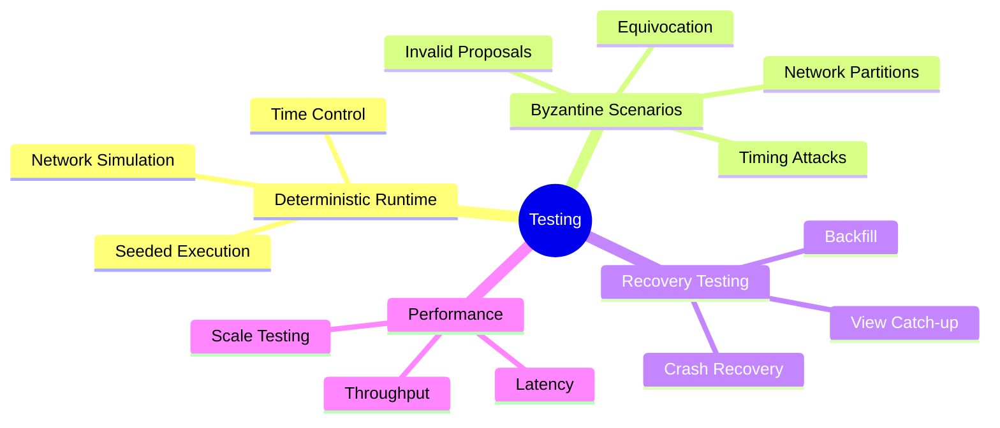

### Test Patterns

```rust
// Deterministic execution
let runner = deterministic::Runner::seeded(42);
runner.start(|context| async move {
    // Simulate network
    let (network, oracle) = Network::new(context, config);
    
    // Add Byzantine actors
    if byzantine {
        spawn_byzantine_actor(context);
    }
    
    // Run consensus
    let engine = Engine::new(context, config);
    engine.start(network);
    
    // Verify properties
    assert_safety_properties();
    assert_liveness_properties();
});
```

## Monitoring & Metrics

### Available Metrics

| Metric | Type | Description |
|--------|------|-------------|
| `view_latency` | Histogram | Time to complete view |
| `finalization_latency` | Histogram | Time to finalize |
| `messages_sent` | Counter | Messages by type |
| `messages_received` | Counter | Messages by type |
| `byzantine_faults` | Counter | Detected faults |
| `current_view` | Gauge | Current view number |
| `finalized_height` | Gauge | Latest finalized |

### Activity Reporting

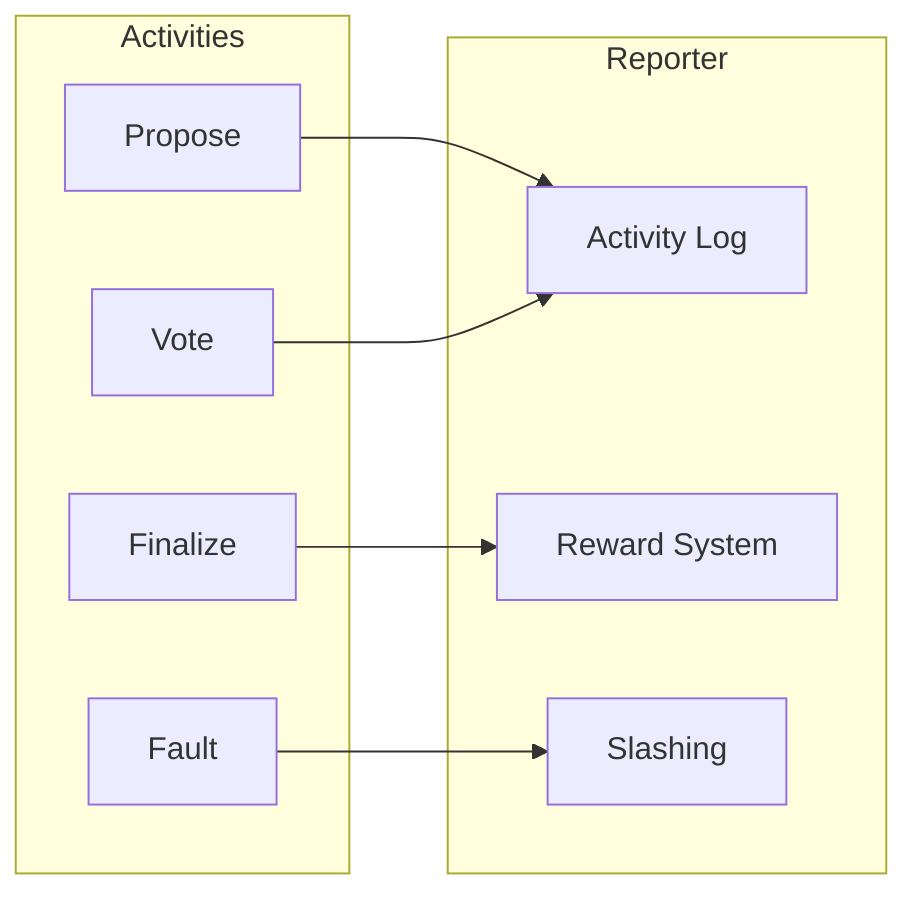

## Integration Guide

### Implementing Automaton

```rust
impl Automaton for MyApp {
    type Context = ViewContext;
    type Digest = [u8; 32];
    
    async fn genesis(&mut self) -> Self::Digest {
        // Return genesis block hash
    }
    
    async fn propose(&mut self, ctx: Self::Context) 
        -> oneshot::Receiver<Self::Digest> {
        // Generate block proposal
    }
    
    async fn verify(&mut self, ctx: Self::Context, payload: Self::Digest)
        -> oneshot::Receiver<bool> {
        // Verify proposed block
    }
}
```

### Starting Consensus

```rust
// Initialize components
let supervisor = MySupervisor::new(validators);
let automaton = MyApp::new();
let relay = MyRelay::new();
let reporter = MyReporter::new();

// Create engine
let engine = simplex::Engine::new(
    context,
    config,
    automaton,
    relay,
    reporter,
    supervisor,
);

// Start consensus
engine.start(network);
```

## Best Practices

### 1. Network Configuration
- Set `delta` to 1.5-2x expected network latency
- Use larger timeouts for geo-distributed networks
- Monitor actual latencies and adjust

### 2. Storage Management
- Size WAL for expected message rate
- Implement pruning for old finalizations
- Use immutable storage for permanent data

### 3. Byzantine Resilience
- Always verify before voting
- Implement comprehensive slashing
- Monitor for equivocation patterns

### 4. Performance Optimization
- Use threshold signatures for large networks
- Enable lazy verification when possible
- Batch operations where applicable

## Troubleshooting

### Common Issues

| Issue | Symptoms | Solution |
|-------|----------|----------|
| Stuck Views | No progress | Check network connectivity, verify 2f+1 online |
| High Latency | Slow finalization | Reduce delta, check network delays |
| Memory Growth | Increasing usage | Implement pruning, check WAL size |
| Byzantine Behavior | Conflicting messages | Enable slashing, check validator set |

## Future Work

- **State Sync**: Fast sync without full history
- **Dynamic Participation**: Validator set changes without epochs
- **Compression**: Reduce message sizes
- **Parallel Verification**: Multi-threaded proposal verification
- **Cross-Chain**: Inter-blockchain consensus certificates