I'll create a comprehensive technical document for the Threshold Simplex consensus protocol based on the code you've provided.

# Threshold Simplex Consensus Protocol - Technical Documentation

## Table of Contents

1. [Overview](#overview)
2. [Architecture](#architecture)
3. [Protocol Design](#protocol-design)
4. [Message Types](#message-types)
5. [Components](#components)
6. [Protocol Flow](#protocol-flow)
7. [Security Features](#security-features)
8. [Implementation Details](#implementation-details)

## Overview

Threshold Simplex is a Byzantine Fault Tolerant (BFT) consensus protocol that combines the simplicity of Simplex Consensus with threshold cryptography using BLS12-381 signatures. It provides fast block times (2 network hops), optimal finalization latency (3 network hops), and generates succinct consensus certificates.

### Key Features

- **Fast Block Times**: 2 network hops for notarization
- **Optimal Finalization**: 3 network hops for finality
- **Embedded VRF**: Built-in verifiable random function for leader election
- **Succinct Certificates**: Threshold signatures provide compact proofs
- **Lazy Verification**: Messages verified only when quorum is reached
- **Fault Proofs**: Externalized uptime and Byzantine behavior detection

## Architecture

### System Components

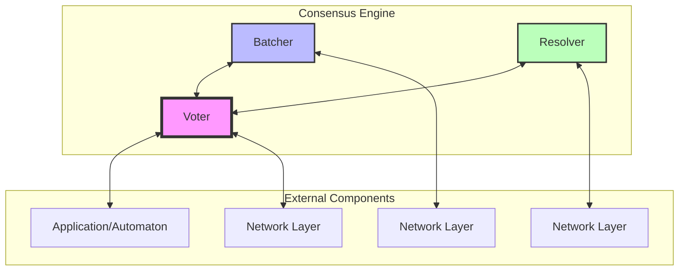

### Component Responsibilities

| Component       | Responsibility                                                  |
| --------------- | --------------------------------------------------------------- |
| **Voter**       | Main consensus logic, proposal generation, message broadcasting |
| **Batcher**     | Lazy signature verification, batching messages for efficiency   |
| **Resolver**    | Fetching missing notarizations/nullifications from peers        |
| **Application** | Block proposal generation and verification                      |

## Protocol Design

### View Progression

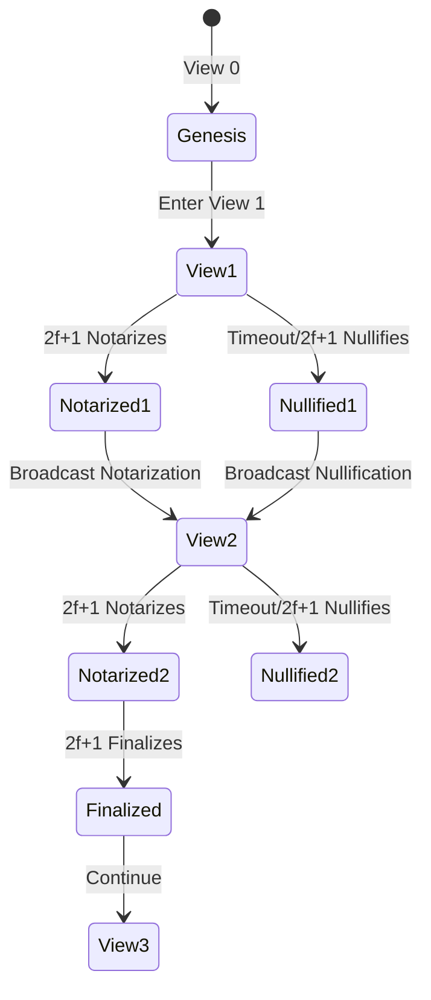

### Threshold Cryptography

The protocol uses BLS12-381 threshold signatures with a `2f+1` of `3f+1` quorum:

- **n**: Total number of validators
- **f**: Maximum Byzantine validators (n = 3f + 1)
- **Threshold**: 2f + 1 signatures required

## Message Types

### Partial Signatures (Individual Validators)

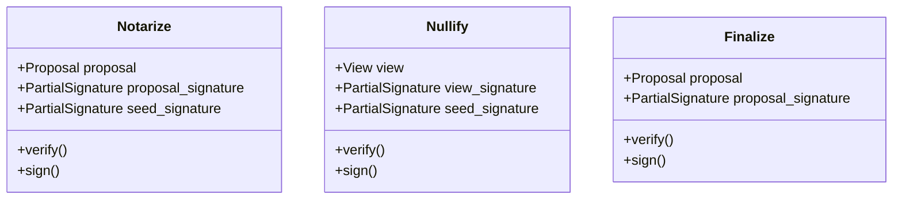

### Threshold Signatures (Aggregated)

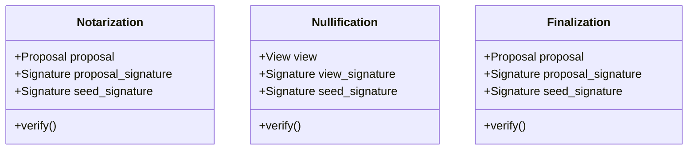

### Byzantine Evidence

| Evidence Type           | Description                                            |
| ----------------------- | ------------------------------------------------------ |
| **ConflictingNotarize** | Validator sent different notarizes for same view       |
| **ConflictingFinalize** | Validator sent different finalizes for same view       |
| **NullifyFinalize**     | Validator sent both nullify and finalize for same view |

## Components

### Voter Component

The Voter is the core consensus component that:

1. **Manages view progression**
2. **Handles proposal generation** (when leader)
3. **Broadcasts consensus messages**
4. **Maintains consensus state**
5. **Persists messages to journal**

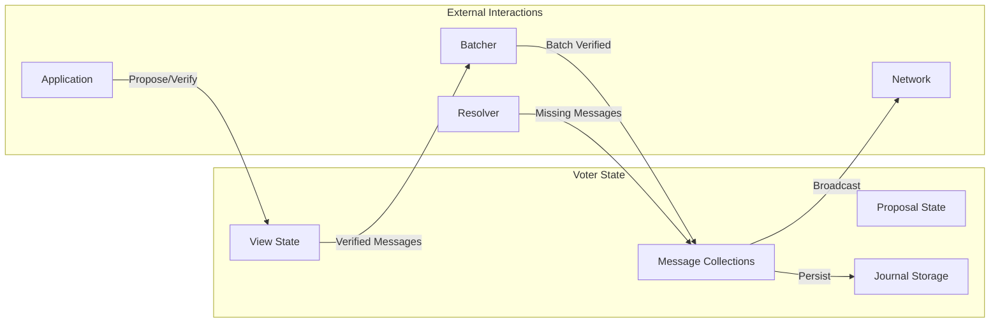

### Batcher Component

The Batcher implements lazy verification:

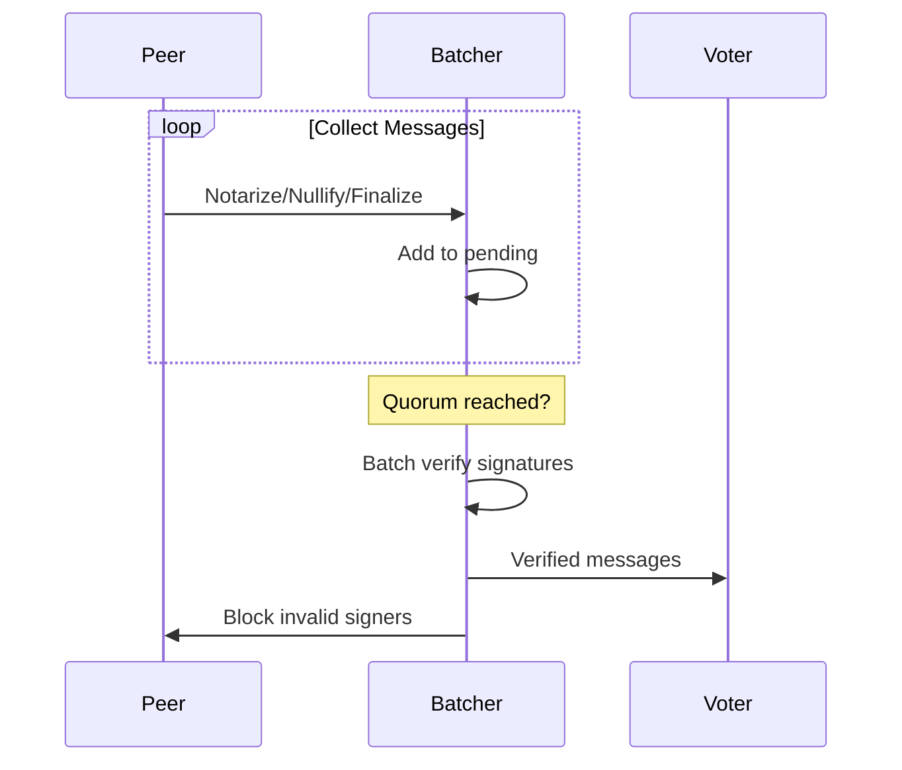

### Resolver Component

Handles synchronization when validators are behind:

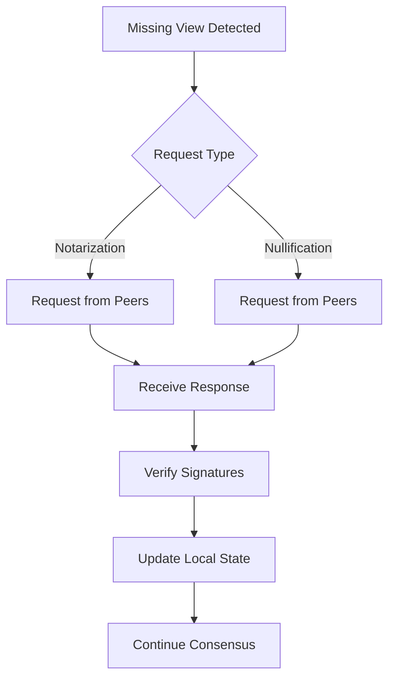

## Protocol Flow

### Happy Path (Leader Proposes)

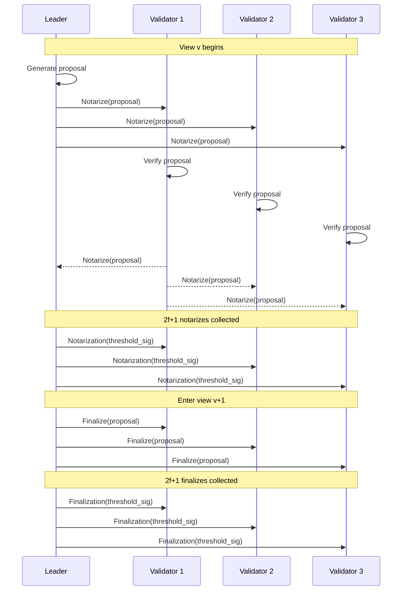

### Timeout Path (Leader Unresponsive)

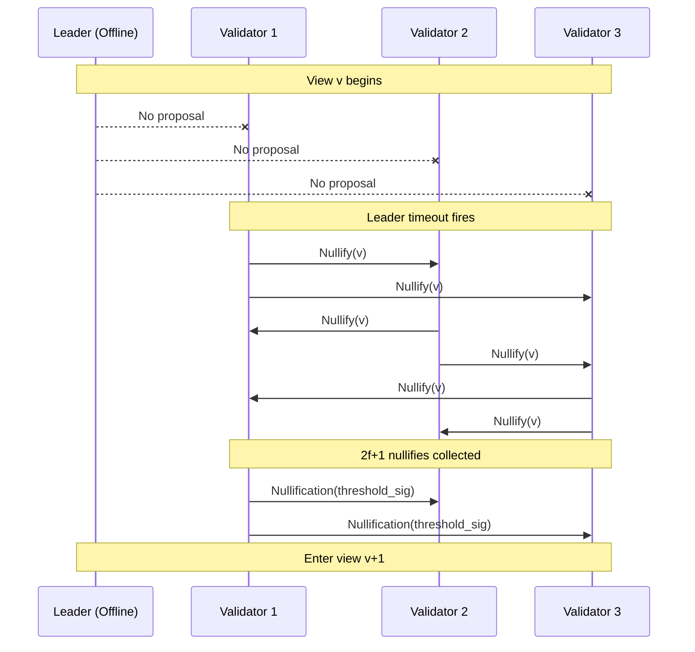

## Security Features

### Byzantine Fault Detection

The protocol detects and reports Byzantine behavior:

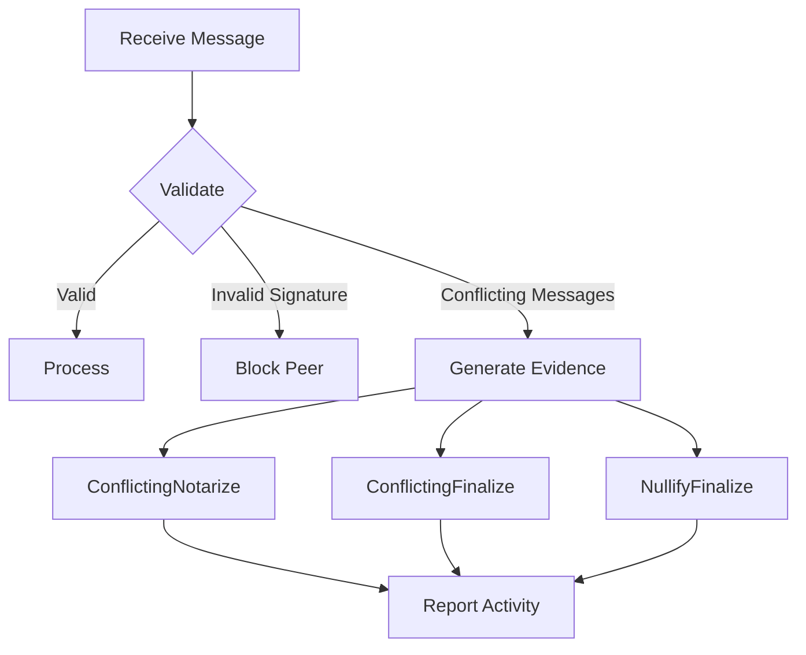

### Leader Election

Leaders are selected using VRF from the previous view's seed:

```rust
// Pseudocode
fn select_leader(view: View, seed: Signature) -> ValidatorIndex {
    let seed_bytes = seed.encode();
    let leader_index = hash(seed_bytes) % num_validators;
    validators[leader_index]
}
```

### Activity Tracking

The protocol tracks validator participation:

| Activity      | Description                         | Verified |
| ------------- | ----------------------------------- | -------- |
| Notarize      | Individual vote to accept proposal  | No       |
| Notarization  | Threshold certificate of acceptance | Yes      |
| Nullify       | Individual vote to skip view        | No       |
| Nullification | Threshold certificate to skip       | Yes      |
| Finalize      | Individual vote to finalize         | No       |
| Finalization  | Threshold certificate of finality   | Yes      |

## Implementation Details

### Configuration Parameters

```rust
pub struct Config {
    // Timeouts
    pub leader_timeout: Duration,        // Time to wait for leader proposal
    pub notarization_timeout: Duration,  // Time to wait for notarization
    pub nullify_retry: Duration,         // Retry interval for nullify

    // Activity tracking
    pub activity_timeout: View,          // Views to track behind finalized
    pub skip_timeout: View,              // Views of inactivity before skipping

    // Network parameters
    pub fetch_timeout: Duration,         // Timeout for fetch requests
    pub max_fetch_count: usize,         // Max items per fetch
    pub fetch_concurrent: usize,        // Concurrent fetch requests

    // Storage
    pub replay_buffer: NonZeroUsize,    // Journal replay buffer size
    pub write_buffer: NonZeroUsize,     // Journal write buffer size
}
```

### Persistence Strategy

The Voter component uses a Write-Ahead Log (WAL) for persistence:

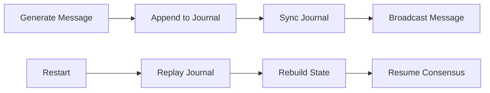

### Batch Verification Optimization

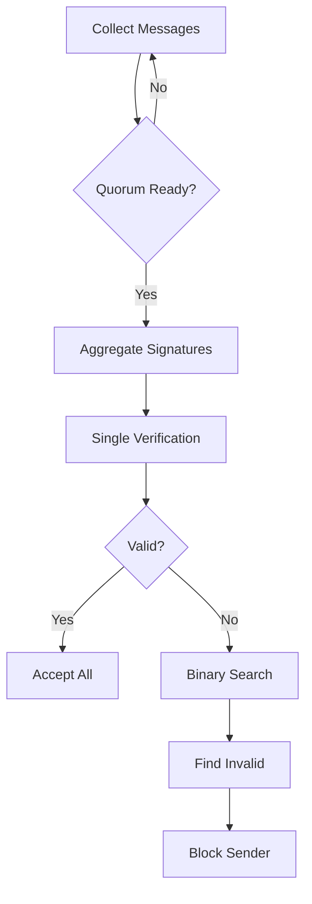

### Message Flow Between Components

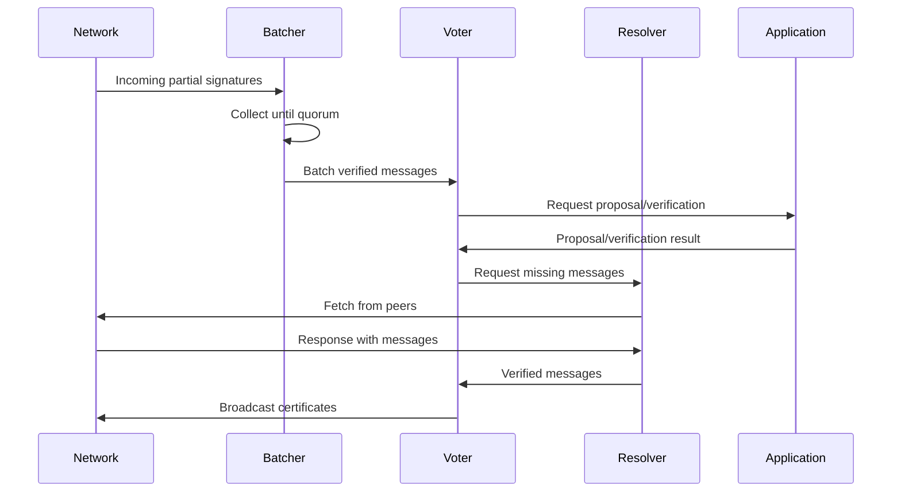

## Performance Characteristics

| Metric                 | Value               | Description                |
| ---------------------- | ------------------- | -------------------------- |
| **Block Time**         | 2 network hops      | Time to notarization       |
| **Finalization**       | 3 network hops      | Time to finality           |
| **Message Complexity** | O(n²)               | All-to-all communication   |
| **Certificate Size**   | O(1)                | Single threshold signature |
| **State Storage**      | O(activity_timeout) | Views tracked in memory    |

## Conclusion

Threshold Simplex provides a robust, efficient consensus protocol that combines:

- Simple view-based progression
- Efficient threshold cryptography
- Built-in randomness generation
- Comprehensive fault detection
- Optimized verification strategies

The protocol achieves excellent performance characteristics while maintaining strong Byzantine fault tolerance guarantees suitable for production blockchain systems.
