# P2P Network Architecture Documentation

## Table of Contents

1. [C4 Model Overview](#c4-model-overview)
2. [Level 1: System Context](#level-1-system-context)
3. [Level 2: Container Diagram](#level-2-container-diagram)
4. [Level 3: Component Diagrams](#level-3-component-diagrams)
5. [Level 4: Code-Level Details](#level-4-code-level-details)
6. [Critical Process Flows](#critical-process-flows)
7. [Architecture Decision Records](#architecture-decision-records)

---

## C4 Model Overview

This documentation describes the architecture of the commonware-p2p library using the C4 Model, providing four levels of abstraction from high-level system context down to code-level implementation details.

### Architecture Principles

- **Authenticated Communication**: All peer connections are cryptographically authenticated
- **Encrypted Transport**: All messages are encrypted in transit
- **Rate Limiting**: Per-channel and per-peer rate limiting to prevent abuse
- **Modular Design**: Clear separation between discovery and lookup mechanisms
- **Actor-Based Concurrency**: Uses actor pattern for managing concurrent operations

---

## Level 1: System Context

### Overview

The P2P system enables authenticated, encrypted communication between distributed peers in a network.

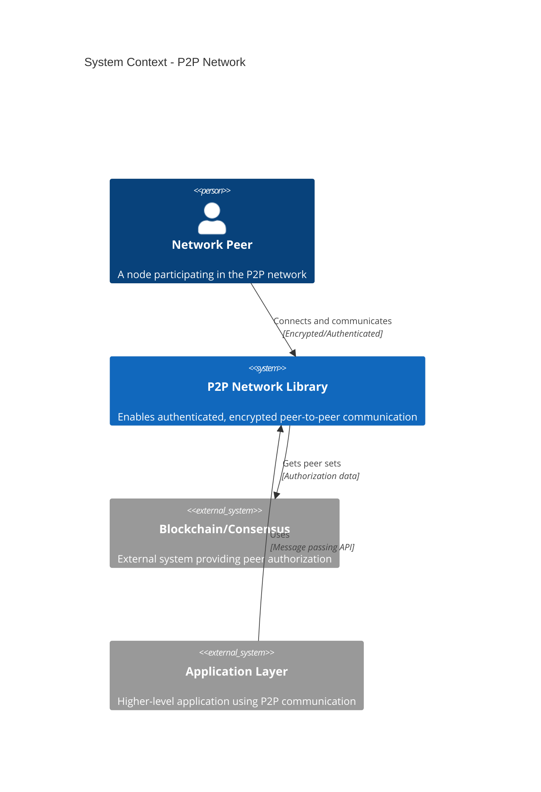

### Key Actors

- **Network Peers**: Nodes that participate in the P2P network
- **Application Layer**: Higher-level applications that use the P2P library
- **External Authority**: Systems that provide peer authorization (e.g., blockchain staking sets)

---

## Level 2: Container Diagram

### Overview

The P2P system consists of multiple containers that handle different aspects of peer communication.

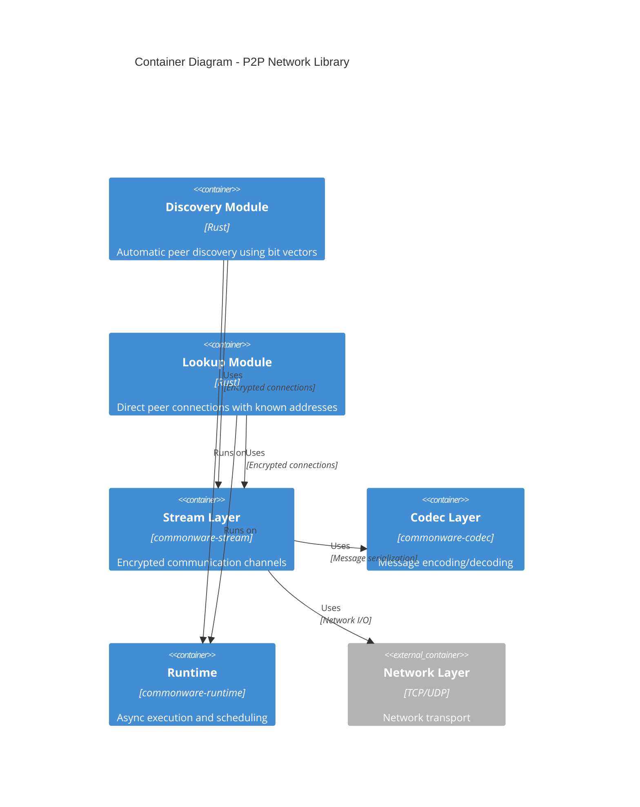

### Container Descriptions

| Container | Purpose                  | Technology         | Responsibilities                                         |
| --------- | ------------------------ | ------------------ | -------------------------------------------------------- |
| Discovery | Automatic peer discovery | Rust + Actors      | Peer discovery, bit vector gossip, connection management |
| Lookup    | Direct peer connections  | Rust + Actors      | Known peer connections, simplified routing               |
| Stream    | Encrypted channels       | commonware-stream  | Encryption, authentication, stream multiplexing          |
| Codec     | Message encoding         | commonware-codec   | Serialization, deserialization, wire format              |
| Runtime   | Async execution          | commonware-runtime | Task scheduling, I/O, timers                             |

---

## Level 3: Component Diagrams

### 3.1 Discovery Module Components

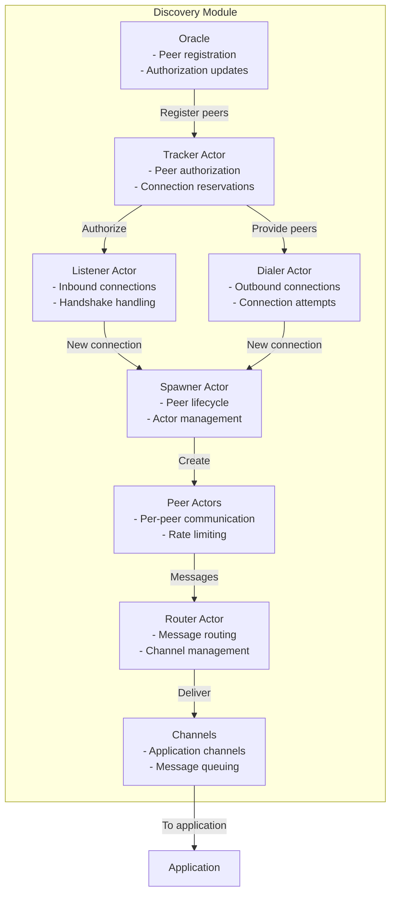

### 3.2 Lookup Module Components

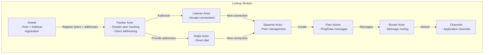

### 3.3 Message Types and Flow

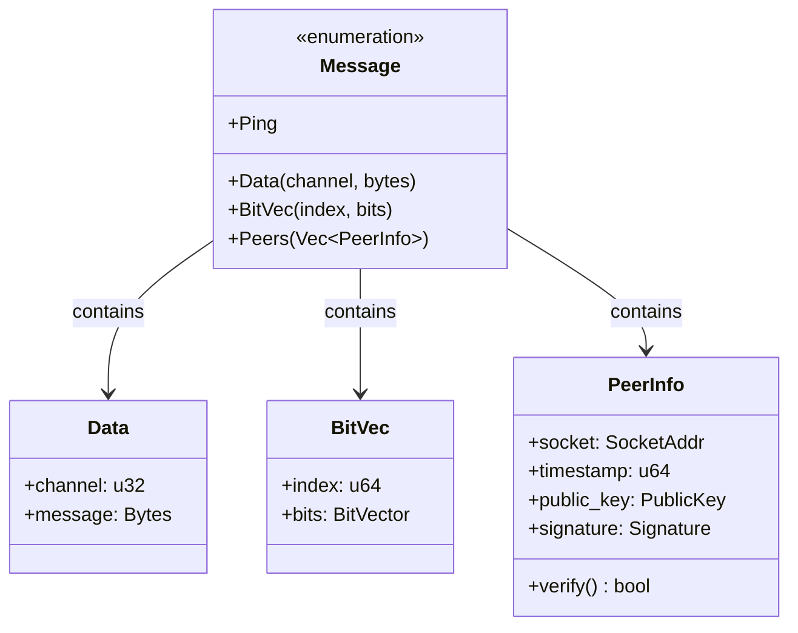

---

## Level 4: Code-Level Details

### 4.1 Actor Architecture

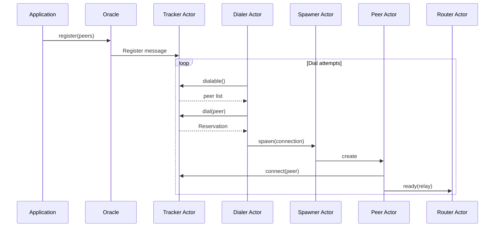

### 4.2 Connection State Machine

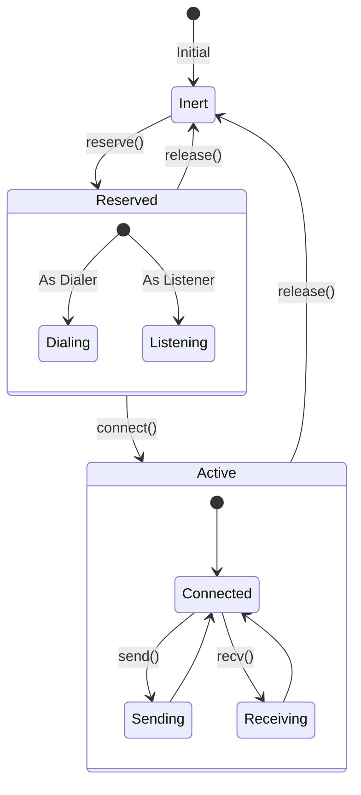

### 4.3 Rate Limiting Implementation

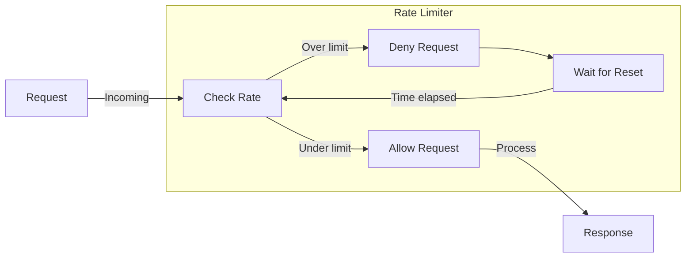

---

## Critical Process Flows

### 5.1 Peer Discovery Flow (Discovery Module)

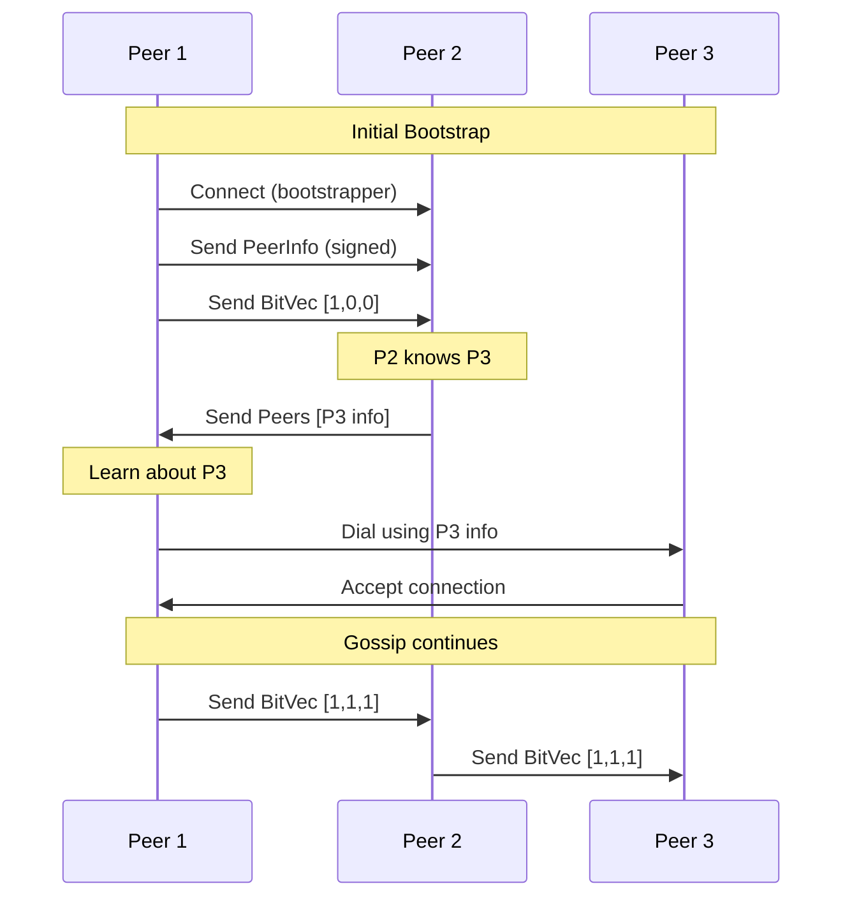

### 5.2 Message Routing Flow

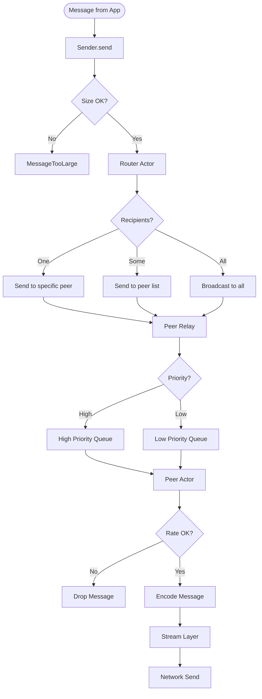

### 5.3 Connection Establishment Flow

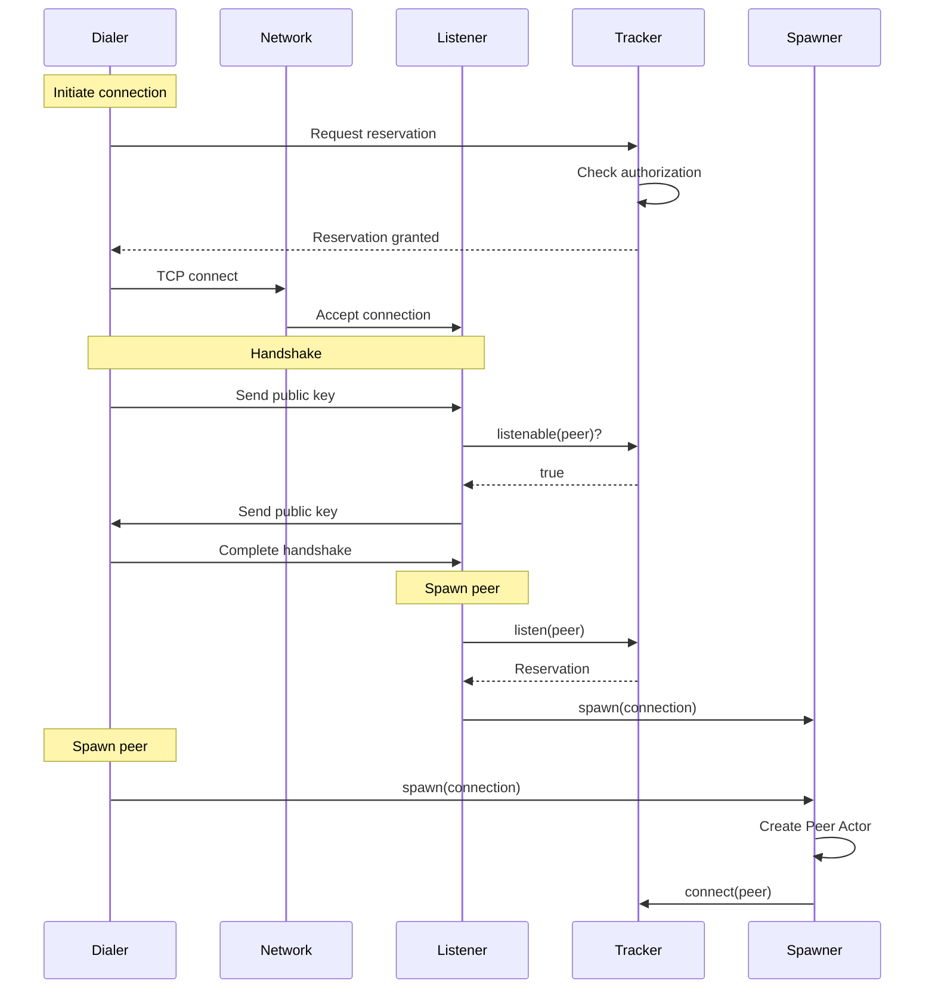

### 5.4 Peer Authorization Update Flow

```mermaid
flowchart LR
    subgraph "External Authority"
        Blockchain[Blockchain/Consensus]
    end

    subgraph "Application"
        App[Application Layer]
    end

    subgraph "P2P Library"
        Oracle[Oracle]
        Tracker[Tracker]
        Peers[Active Peers]
    end

    Blockchain -->|New peer set| App
    App -->|register(index, peers)| Oracle
    Oracle -->|Update| Tracker
    Tracker -->|Check active| Peers
    Tracker -->|Kill unauthorized| Peers
    Tracker -->|Update routing| Tracker
```

---

## Architecture Decision Records

### ADR-001: Actor-Based Architecture

**Status**: Accepted

**Context**: Need to manage concurrent operations for multiple peers with independent state.

**Decision**: Use actor pattern with message passing for concurrency control.

**Consequences**:

- ✅ Simplified reasoning about concurrent state
- ✅ Natural isolation between peer connections
- ✅ Easy to add new actor types
- ❌ Message passing overhead
- ❌ Debugging can be more complex

### ADR-002: Separate Discovery and Lookup Modules

**Status**: Accepted

**Context**: Different use cases require different peer discovery mechanisms.

**Decision**: Implement two separate modules:

- Discovery: For networks where peer addresses are unknown
- Lookup: For networks where peer addresses are known

**Consequences**:

- ✅ Optimized for specific use cases
- ✅ Simpler implementation for each module
- ✅ Can choose appropriate module
- ❌ Some code duplication
- ❌ Two APIs to maintain

### ADR-003: Rate Limiting Strategy

**Status**: Accepted

**Context**: Need to prevent DoS attacks and resource exhaustion.

**Decision**: Implement multi-level rate limiting:

- Per-peer connection rate limiting
- Per-channel message rate limiting
- Global incoming connection rate limiting

**Consequences**:

- ✅ Fine-grained control over resource usage
- ✅ Protection against various attack vectors
- ✅ Fair resource allocation
- ❌ Additional complexity
- ❌ Potential for legitimate traffic to be limited

### ADR-004: Bit Vector Discovery Protocol

**Status**: Accepted

**Context**: Need efficient way to communicate peer knowledge in discovery module.

**Decision**: Use bit vectors indexed by peer set to communicate knowledge.

**Consequences**:

- ✅ Very bandwidth efficient
- ✅ O(n) bits for n peers
- ✅ Natural gossip protocol
- ❌ Requires synchronized peer set knowledge
- ❌ Limited to tracked peer sets

---

## Performance Characteristics

### Scalability Metrics

| Metric              | Discovery Module         | Lookup Module      |
| ------------------- | ------------------------ | ------------------ |
| Connection Overhead | O(n) for bit vectors     | O(1) direct dial   |
| Discovery Time      | O(log n) hops            | Immediate          |
| Memory per Peer     | ~1KB + channels          | ~500B + channels   |
| Message Overhead    | 11 bytes + payload       | 11 bytes + payload |
| Max Peer Sets       | Configurable (default 4) | Configurable       |
| Max Peers per Set   | 2^16 (65,536)            | Unlimited          |

### Resource Limits

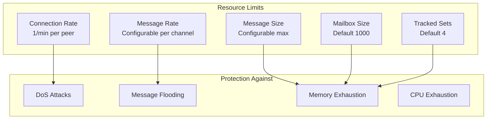

---

## Security Model

### Trust Boundaries

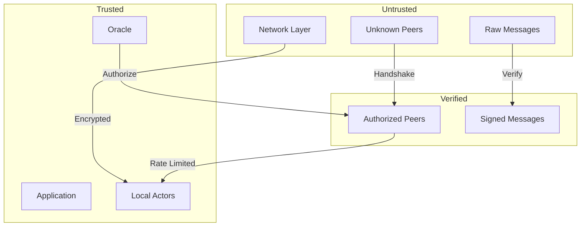

### Security Properties

1. **Authentication**: All peers are cryptographically authenticated
2. **Encryption**: All messages are encrypted in transit
3. **Authorization**: Only authorized peers can connect
4. **Rate Limiting**: Protection against resource exhaustion
5. **Message Integrity**: All messages are authenticated
6. **Replay Protection**: Timestamps and nonces prevent replay attacks

---

## Deployment Considerations

### Configuration Parameters

| Parameter                          | Description        | Recommended Production | Aggressive (Demo)    |
| ---------------------------------- | ------------------ | ---------------------- | -------------------- |
| `synchrony_bound`                  | Max clock skew     | 5 seconds              | 5 seconds            |
| `handshake_timeout`                | Connection timeout | 5 seconds              | 5 seconds            |
| `allowed_connection_rate_per_peer` | Per-peer rate      | 1/minute               | 1/second             |
| `dial_frequency`                   | Dial attempt rate  | 1 second               | 500ms                |
| `query_frequency`                  | Peer list refresh  | 60 seconds             | 30 seconds           |
| `gossip_bit_vec_frequency`         | Discovery gossip   | 50 seconds             | 5 seconds            |
| `max_message_size`                 | Maximum message    | Application-specific   | Application-specific |

### Network Requirements

- **Bandwidth**: Minimal overhead (~11 bytes per message + encryption)
- **Latency**: Configurable timeouts, typically 5-60 seconds
- **Connectivity**: Supports NAT traversal through peer introduction
- **Ports**: Single listening port per node

---

## Conclusion

The commonware-p2p library provides a robust, scalable, and secure foundation for peer-to-peer networking with:

- **Modular architecture** supporting different discovery mechanisms
- **Actor-based concurrency** for scalable peer management
- **Multi-layered security** with authentication, encryption, and rate limiting
- **Efficient protocols** for peer discovery and message routing
- **Flexible configuration** for different deployment scenarios

The architecture supports both small private networks and large public networks with thousands of peers, while maintaining security and performance characteristics suitable for production blockchain and distributed systems.
