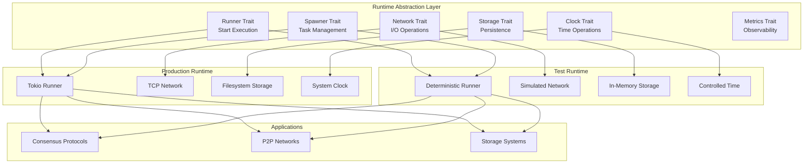
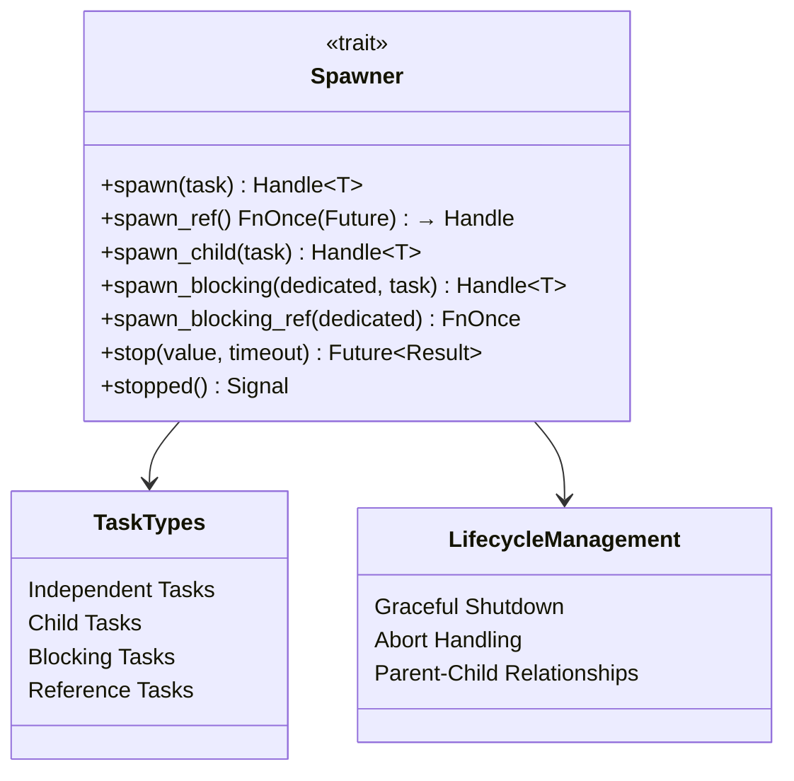
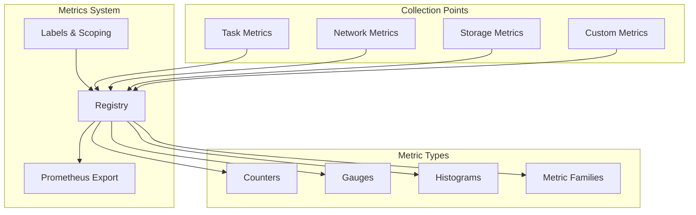
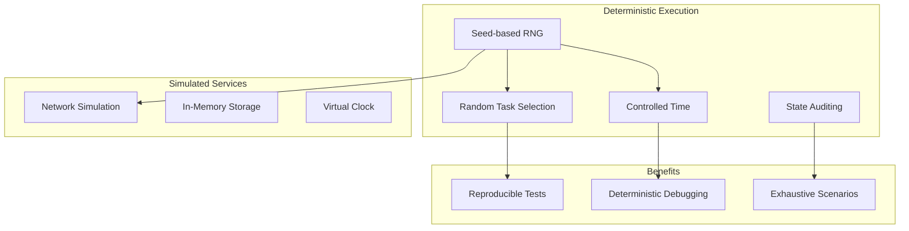
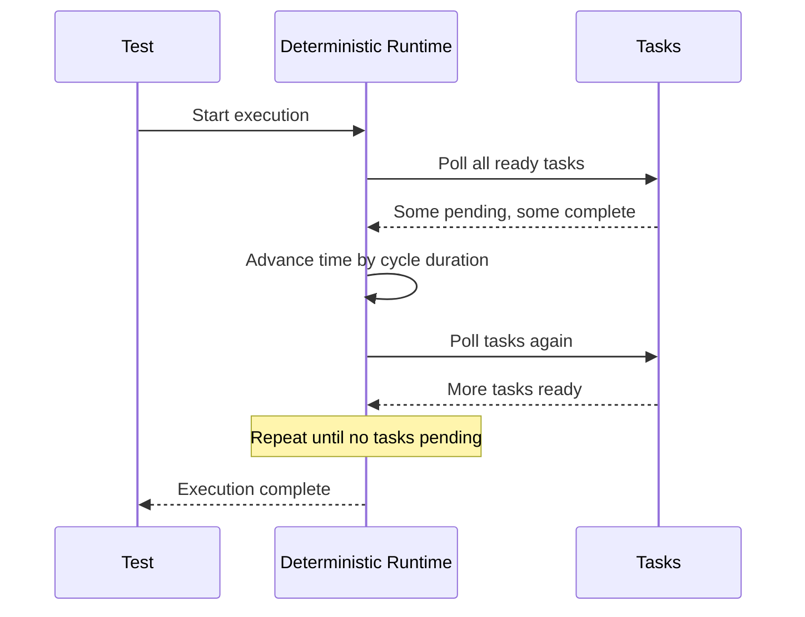
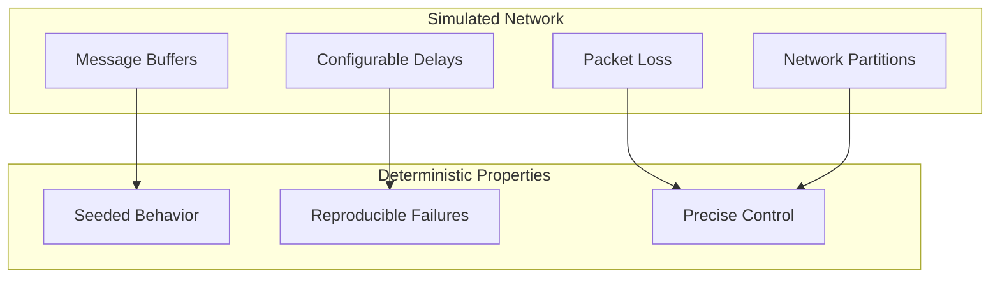
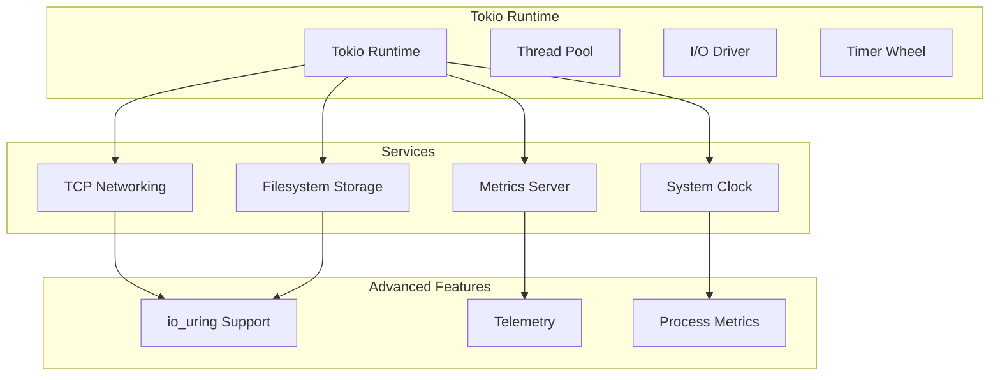
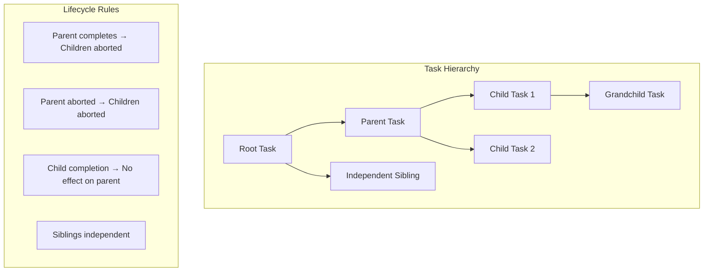
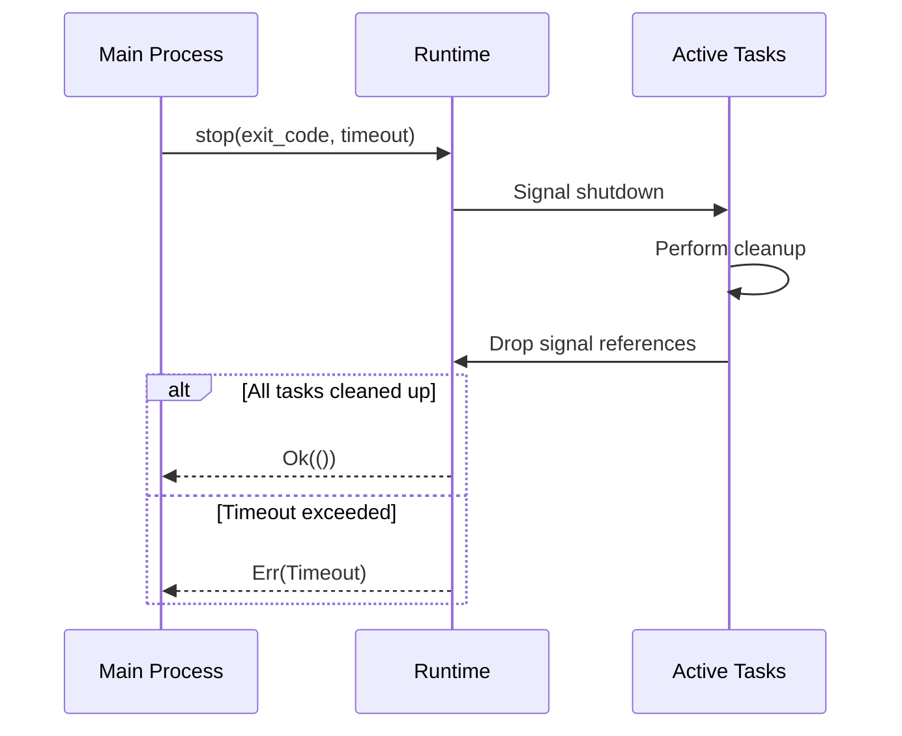

# Runtime Module - Technical Documentation

## Overview

The `commonware-runtime` module provides configurable asynchronous task schedulers designed for executing async tasks in distributed systems. It offers both production-ready (Tokio-based) and deterministic (simulation-based) runtimes, enabling comprehensive testing and deployment of distributed systems primitives.

**Key Features:**
- Runtime-agnostic abstractions for portability
- Deterministic execution for reproducible testing
- Comprehensive telemetry and metrics
- Network, storage, and clock abstractions
- Task lifecycle management with parent-child relationships

## Architecture Overview



## Core Trait System

### 1. Runner Trait

The foundational trait for starting runtime execution:

```rust
pub trait Runner {
    type Context;
    
    fn start<F, Fut>(self, f: F) -> Fut::Output
    where
        F: FnOnce(Self::Context) -> Fut,
        Fut: Future;
}
```

**Purpose:**
- Initializes runtime environment
- Starts root task execution
- Provides context with all necessary services

### 2. Spawner Trait

Manages task creation and lifecycle:



**Task Types:**

| Method | Purpose | Characteristics |
|--------|---------|-----------------|
| `spawn()` | Independent async task | Runs until completion or abort |
| `spawn_child()` | Child task | Auto-aborted when parent completes |
| `spawn_blocking()` | CPU-intensive work | Runs on dedicated/shared thread pool |
| `spawn_ref()` | Task without consuming context | Prevents accidental context sharing |

### 3. Clock Trait

Provides time-based operations:

```rust
pub trait Clock: Clone + Send + Sync + 'static {
    fn current(&self) -> SystemTime;
    fn sleep(&self, duration: Duration) -> impl Future<Output = ()> + Send;
    fn sleep_until(&self, deadline: SystemTime) -> impl Future<Output = ()> + Send;
}
```

**Implementations:**
- **Production**: System time with real delays
- **Deterministic**: Controlled time advancement for testing

### 4. Network Trait

Abstracts network operations:

```mermaid
graph LR
    subgraph "Network Abstraction"
        NET[Network]
        LISTEN[Listener]
        SINK[Sink]
        STREAM[Stream]
    end
    
    subgraph "Operations"
        BIND[bind(address)]
        DIAL[dial(address)]
        ACCEPT[accept()]
        SEND[send(data)]
        RECV[recv(buffer)]
    end
    
    NET --> BIND
    NET --> DIAL
    LISTEN --> ACCEPT
    SINK --> SEND
    STREAM --> RECV
    
    BIND --> LISTEN
    DIAL --> SINK
    DIAL --> STREAM
    ACCEPT --> SINK
    ACCEPT --> STREAM
```

**Key Features:**
- Async TCP-like interface
- Configurable underlying transport
- Deterministic network simulation for testing

### 5. Storage Trait

Provides persistent storage abstraction:

```rust
pub trait Storage: Clone + Send + Sync + 'static {
    type Blob: Blob;
    
    fn open(&self, partition: &str, name: &[u8]) 
        -> impl Future<Output = Result<(Self::Blob, u64), Error>>;
    fn remove(&self, partition: &str, name: Option<&[u8]>) 
        -> impl Future<Output = Result<(), Error>>;
    fn scan(&self, partition: &str) 
        -> impl Future<Output = Result<Vec<Vec<u8>>, Error>>;
}

pub trait Blob: Clone + Send + Sync + 'static {
    fn read_at(&self, buf: StableBuf, offset: u64) 
        -> impl Future<Output = Result<StableBuf, Error>>;
    fn write_at(&self, buf: StableBuf, offset: u64) 
        -> impl Future<Output = Result<(), Error>>;
    fn resize(&self, len: u64) 
        -> impl Future<Output = Result<(), Error>>;
    fn sync(&self) -> impl Future<Output = Result<(), Error>>;
}
```

**Storage Model:**
- **Partitions**: Logical containers for related blobs
- **Blobs**: Individual storage units with read/write/resize operations
- **Concurrent Access**: Thread-safe with blob-level synchronization

### 6. Metrics Trait

Enables observability and monitoring:



## Deterministic Runtime

### Core Concepts

The deterministic runtime enables reproducible execution for testing distributed systems:



### Deterministic Features

#### 1. Seeded Random Execution

```rust
let executor = deterministic::Runner::seeded(42);
executor.start(|context| async move {
    // All randomness is deterministic based on seed
    // Task scheduling order is reproducible
    // Network delays are consistent
});
```

#### 2. Controlled Time Advancement



#### 3. State Auditing

```rust
let executor = deterministic::Runner::default();
executor.start(|context| async move {
    // Perform operations
    spawn_tasks(context).await;
    
    // Get deterministic state hash
    let state = context.auditor().state();
    println!("Final state: {}", state);
    // Same seed always produces same state hash
});
```

**Auditing Features:**
- **Event Recording**: All significant operations logged
- **State Hashing**: SHA-256 based state fingerprinting
- **Determinism Verification**: Same seed = same final state

#### 4. Network Simulation



### Configuration Options

```rust
use commonware_runtime::deterministic;
use std::time::Duration;

// Basic configuration
let config = deterministic::Config::new()
    .with_seed(12345)                              // Deterministic seed
    .with_cycle(Duration::from_millis(1))         // Time advancement
    .with_timeout(Some(Duration::from_secs(30))); // Test timeout

let runner = deterministic::Runner::new(config);

// Convenience constructors
let runner = deterministic::Runner::default();                    // Default settings
let runner = deterministic::Runner::seeded(42);                   // Custom seed
let runner = deterministic::Runner::timed(Duration::from_secs(5)); // With timeout
```

## Production Runtime (Tokio)

### Tokio Integration

The production runtime provides real-world execution capabilities:



### Performance Features

#### 1. io_uring Support

For high-performance I/O on Linux:

```rust
// Network with io_uring
#[cfg(feature = "iouring-network")]
use commonware_runtime::iouring::Network;

// Storage with io_uring  
#[cfg(feature = "iouring-storage")]
use commonware_runtime::iouring::Storage;
```

#### 2. Telemetry Integration

```rust
use commonware_runtime::tokio::telemetry;
use tracing::Level;
use std::net::SocketAddr;

let address = "127.0.0.1:8080".parse::<SocketAddr>().unwrap();

tokio::telemetry::init(
    context.with_label("app_metrics"),
    telemetry::Logging {
        level: Level::INFO,
        json: true,  // Structured logging
    },
    Some(address),  // Metrics HTTP server
    None,          // Optional TLS config
);
```

#### 3. Process Metrics

Automatic system resource monitoring:

```rust
// Automatically collected metrics:
// - runtime_process_rss: Memory usage
// - runtime_process_cpu: CPU usage  
// - runtime_open_fds: File descriptors
// - runtime_threads: Thread count
```

## Task Management

### Parent-Child Relationships



### Task Spawning Patterns

#### 1. Independent Tasks

```rust
// Spawn independent task
let handle = context.spawn(|context| async move {
    // Runs until completion or explicit abort
    perform_background_work(context).await
});

// Task continues even if spawner goes away
drop(context);
handle.await.unwrap();
```

#### 2. Child Tasks

```rust
let parent_handle = context.spawn(|context| async move {
    // Spawn child that gets auto-aborted when parent completes
    let child_handle = context.spawn_child(|context| async move {
        // Long-running work
        loop {
            process_data(context).await;
            context.sleep(Duration::from_secs(1)).await;
        }
    });
    
    // When parent returns, child is automatically aborted
    "parent complete"
});

parent_handle.await.unwrap(); // Child is now aborted
```

#### 3. Blocking Tasks

```rust
// CPU-intensive work on dedicated thread
let handle = context.spawn_blocking(true, |context| {
    expensive_computation()
});

// Quick blocking work on shared thread pool
let handle = context.spawn_blocking(false, |context| {
    quick_sync_operation()
});
```

#### 4. Reference Spawning

```rust
// Spawn without consuming context (use carefully)
let mut ctx = context;
let spawn_fn = ctx.spawn_ref();
let handle = spawn_fn(async move { "task result" });

// Context can still be used, but only once more
ctx.spawn(|_| async move { "another task" });
```

### Graceful Shutdown



#### Shutdown Implementation

```rust
// In long-running tasks, monitor shutdown signal
context.spawn(|context| async move {
    let mut shutdown = context.stopped();
    
    loop {
        select! {
            // Normal work
            _ = work_iteration() => continue,
            
            // Shutdown signal received
            exit_code = &mut shutdown => {
                cleanup().await;
                return exit_code; 
            }
        }
    }
});

// Trigger shutdown from anywhere
context.stop(0, Some(Duration::from_secs(30))).await?;
```

## Testing Best Practices

### Deterministic Test Patterns

#### 1. Basic Deterministic Test

```rust
#[test]
fn test_consensus_protocol() {
    let runner = deterministic::Runner::seeded(42);
    runner.start(|context| async move {
        // Setup
        let nodes = spawn_consensus_nodes(context.clone(), 5).await;
        
        // Execute protocol
        let result = run_consensus_round(nodes).await;
        
        // Verify deterministic outcome
        assert_eq!(result.leader, expected_leader);
        
        // Verify deterministic state
        assert_eq!(context.auditor().state(), "expected_hash");
    });
}
```

#### 2. Network Partition Testing

```rust
#[test]  
fn test_network_partition() {
    let runner = deterministic::Runner::seeded(123);
    runner.start(|context| async move {
        // Spawn nodes
        let nodes = spawn_distributed_nodes(context, 5).await;
        
        // Simulate partition
        simulate_partition(nodes[0..2], nodes[3..5]).await;
        
        // Verify behavior under partition
        verify_partition_tolerance(nodes).await;
        
        // Heal partition
        heal_partition().await;
        
        // Verify recovery
        verify_recovery(nodes).await;
    });
}
```

#### 3. Time-based Testing

```rust
#[test]
fn test_timeout_behavior() {
    let runner = deterministic::Runner::timed(Duration::from_secs(10));
    runner.start(|context| async move {
        let start = context.current();
        
        // Trigger timeout-dependent behavior
        let result = timeout_based_protocol(context).await;
        
        // Verify timing
        let elapsed = context.current().duration_since(start).unwrap();
        assert!(elapsed >= expected_min_time);
        assert!(elapsed <= expected_max_time);
    });
}
```

### Production Testing

#### 1. Integration Tests

```rust
#[tokio::test]
async fn test_production_integration() {
    let runner = tokio::Runner::default();
    runner.start(|context| async move {
        // Real network and storage
        let server = start_server(context.clone()).await;
        let client = connect_client(context).await;
        
        // Test real I/O
        test_protocol(server, client).await;
    });
}
```

#### 2. Performance Tests

```rust
#[tokio::test]
async fn test_performance() {
    let runner = tokio::Runner::default();
    runner.start(|context| async move {
        let start = std::time::Instant::now();
        
        // High-load test
        let handles: Vec<_> = (0..1000)
            .map(|i| context.spawn(move |ctx| async move {
                perform_operation(ctx, i).await
            }))
            .collect();
        
        // Wait for completion
        for handle in handles {
            handle.await.unwrap();
        }
        
        let duration = start.elapsed();
        assert!(duration < expected_max_duration);
        
        // Check metrics
        let metrics = context.encode();
        assert!(metrics.contains("operations_total 1000"));
    });
}
```

## Error Handling

### Error Types

```rust
#[derive(Error, Debug)]
pub enum Error {
    #[error("exited")]
    Exited,                    // Task exited unexpectedly
    
    #[error("closed")] 
    Closed,                    // Channel or resource closed
    
    #[error("timeout")]
    Timeout,                   // Operation timed out
    
    // Network errors
    #[error("bind failed")]
    BindFailed,
    #[error("connection failed")]
    ConnectionFailed,
    
    // Storage errors  
    #[error("partition creation failed: {0}")]
    PartitionCreationFailed(String),
    #[error("blob open failed: {0}/{1} error: {2}")]
    BlobOpenFailed(String, String, IoError),
    
    // System errors
    #[error("io error: {0}")]
    Io(#[from] IoError),
}
```

### Error Patterns

#### 1. Task Error Handling

```rust
// Handle task failures
let handle = context.spawn(|_| async move {
    // This might fail
    risky_operation().await
});

match handle.await {
    Ok(result) => process_success(result),
    Err(Error::Exited) => handle_task_panic(),
    Err(Error::Closed) => handle_task_abort(),
    Err(other) => handle_other_error(other),
}
```

#### 2. Resource Error Handling

```rust
// Storage operations
match context.open("partition", b"blob_name").await {
    Ok((blob, size)) => use_blob(blob, size).await,
    Err(Error::PartitionMissing(_)) => create_partition().await,
    Err(Error::BlobOpenFailed(..)) => handle_corruption().await,
    Err(e) => return Err(e),
}
```

#### 3. Network Error Handling

```rust
// Network operations with retry
let mut attempts = 0;
loop {
    match context.dial(address).await {
        Ok((sink, stream)) => return Ok(Connection::new(sink, stream)),
        Err(Error::ConnectionFailed) if attempts < 3 => {
            attempts += 1;
            context.sleep(Duration::from_millis(100 * attempts)).await;
            continue;
        }
        Err(e) => return Err(e),
    }
}
```

## Advanced Features

### Buffer Management

The runtime includes efficient buffer management utilities:

```rust
use commonware_runtime::buffer::{Pool, PoolRef};

// Create buffer pool
let pool = Pool::new(1024, 4096); // min 1KB, max 4KB buffers
let pool_ref: PoolRef = pool.into();

// Use in configuration
let config = StorageConfig {
    buffer_pool: pool_ref,
    // ...
};
```

### Custom Metrics

```rust
use prometheus_client::metrics::counter::Counter;

let counter = Counter::<u64>::default();
context.register(
    "custom_operations", 
    "Number of custom operations performed",
    counter.clone()
);

// Use metric
counter.inc();
counter.inc_by(5);

// Metrics automatically included in /metrics endpoint
```

### Signal Handling

```rust
// Monitor for shutdown across tasks
let shutdown_signal = context.stopped();

context.spawn(move |context| async move {
    let mut signal = shutdown_signal;
    
    select! {
        result = long_running_operation() => {
            process_result(result).await;
        }
        exit_code = &mut signal => {
            cleanup().await;
            return exit_code;
        }
    }
});
```

## Runtime Isolation Rule

**CRITICAL DESIGN PRINCIPLE**: All code outside the runtime module must be runtime-agnostic:

```rust
// ❌ WRONG - Don't import tokio directly
use tokio::time::sleep;

// ✅ CORRECT - Use runtime abstraction
use commonware_runtime::Clock;

async fn my_function<C: Clock>(context: C) {
    context.sleep(Duration::from_secs(1)).await;
}
```

**Benefits:**
- **Portability**: Code works with any runtime implementation
- **Testability**: Easy switching between deterministic and production runtimes
- **Flexibility**: Runtime can be swapped without code changes

## Configuration Examples

### Basic Usage

```rust
use commonware_runtime::{Runner, Spawner, Clock};

// Deterministic for testing
let runner = commonware_runtime::deterministic::Runner::seeded(42);
runner.start(|context| async move {
    test_my_protocol(context).await;
});

// Production runtime
let runner = commonware_runtime::tokio::Runner::default();
runner.start(|context| async move {
    run_production_service(context).await;
});
```

### Advanced Configuration

```rust
use commonware_runtime::deterministic::{Runner, Config};
use std::time::Duration;

// Comprehensive test configuration
let config = Config::new()
    .with_seed(12345)
    .with_cycle(Duration::from_millis(5))  // Faster time advancement
    .with_timeout(Some(Duration::from_secs(120))); // 2 minute timeout

let runner = Runner::new(config);
runner.start(|context| async move {
    complex_distributed_test(context).await;
    
    // Verify deterministic execution
    let final_state = context.auditor().state();
    assert_eq!(final_state, expected_deterministic_hash);
});
```

## Best Practices

### 1. Runtime Selection

```rust
// Use feature flags for runtime selection
#[cfg(test)]
fn create_runtime() -> impl Runner {
    commonware_runtime::deterministic::Runner::default()
}

#[cfg(not(test))]  
fn create_runtime() -> impl Runner {
    commonware_runtime::tokio::Runner::default()
}
```

### 2. Context Management

```rust
// Always pass context explicitly
async fn my_service<C>(context: C) 
where 
    C: Spawner + Clock + Storage + Network + Metrics,
{
    // Use context for all operations
    let data = load_data(context.clone()).await;
    process_data(context, data).await;
}
```

### 3. Testing Patterns

```rust
// Test both runtimes
macro_rules! test_both_runtimes {
    ($test_name:ident, $test_body:expr) => {
        #[test]
        fn $test_name() {
            // Deterministic test
            let runner = deterministic::Runner::seeded(42);
            runner.start($test_body);
            
            // Production test  
            let runner = tokio::Runner::default();
            runner.start($test_body);
        }
    };
}

test_both_runtimes!(test_my_protocol, |context| async move {
    let result = my_protocol(context).await;
    assert!(result.is_ok());
});
```

### 4. Resource Cleanup

```rust
// Always handle cleanup properly
context.spawn(|context| async move {
    let resource = acquire_resource(context).await?;
    
    // Ensure cleanup on shutdown
    let mut shutdown = context.stopped();
    
    select! {
        result = use_resource(&resource) => {
            // Normal completion
            cleanup_resource(resource).await;
            result
        }
        _ = &mut shutdown => {
            // Shutdown requested
            cleanup_resource(resource).await;
            Ok(())
        }
    }
});
```

## Migration Guide

### From Direct Tokio Usage

```rust
// Before - direct tokio
use tokio::{spawn, time::sleep};

async fn old_code() {
    spawn(async move {
        sleep(Duration::from_secs(1)).await;
        println!("Done");
    });
}

// After - runtime abstraction
use commonware_runtime::{Spawner, Clock};

async fn new_code<C>(context: C) 
where C: Spawner + Clock 
{
    context.spawn(|context| async move {
        context.sleep(Duration::from_secs(1)).await;
        println!("Done");
    });
}
```

### From std::fs to Storage Trait

```rust
// Before - direct file system
use std::fs;

fn old_storage() {
    let data = fs::read("file.txt").unwrap();
    fs::write("file.txt", b"new data").unwrap();
}

// After - storage abstraction  
use commonware_runtime::Storage;

async fn new_storage<S>(storage: S) -> Result<(), Error>
where S: Storage
{
    let (blob, _) = storage.open("partition", b"file.txt").await?;
    let data = blob.read_at(vec![0; 1024], 0).await?;
    blob.write_at(b"new data".to_vec(), 0).await?;
    blob.sync().await?;
    Ok(())
}
```

## Conclusion

The runtime module provides a comprehensive foundation for building distributed systems with:

1. **Runtime Abstraction**: Code portability across different execution environments
2. **Deterministic Testing**: Reproducible execution for comprehensive testing  
3. **Production Ready**: High-performance runtime for deployment
4. **Comprehensive Services**: Network, storage, time, metrics, and task management
5. **Safety Guarantees**: Proper resource cleanup and error handling

By following the runtime isolation rule and using the provided abstractions, applications can achieve both excellent testability and production performance while maintaining code clarity and correctness.