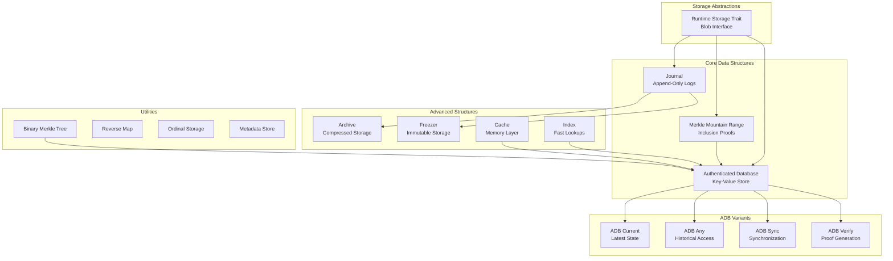
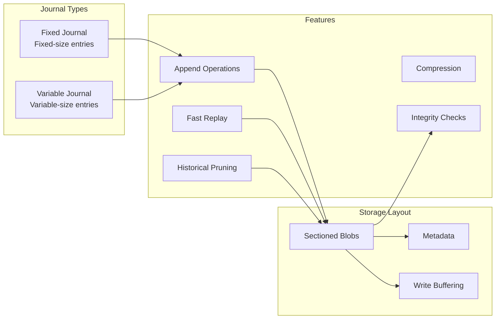
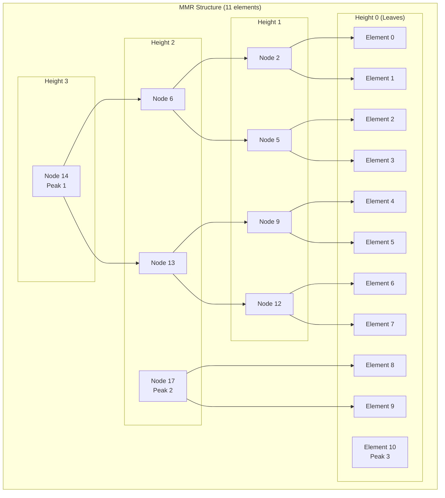
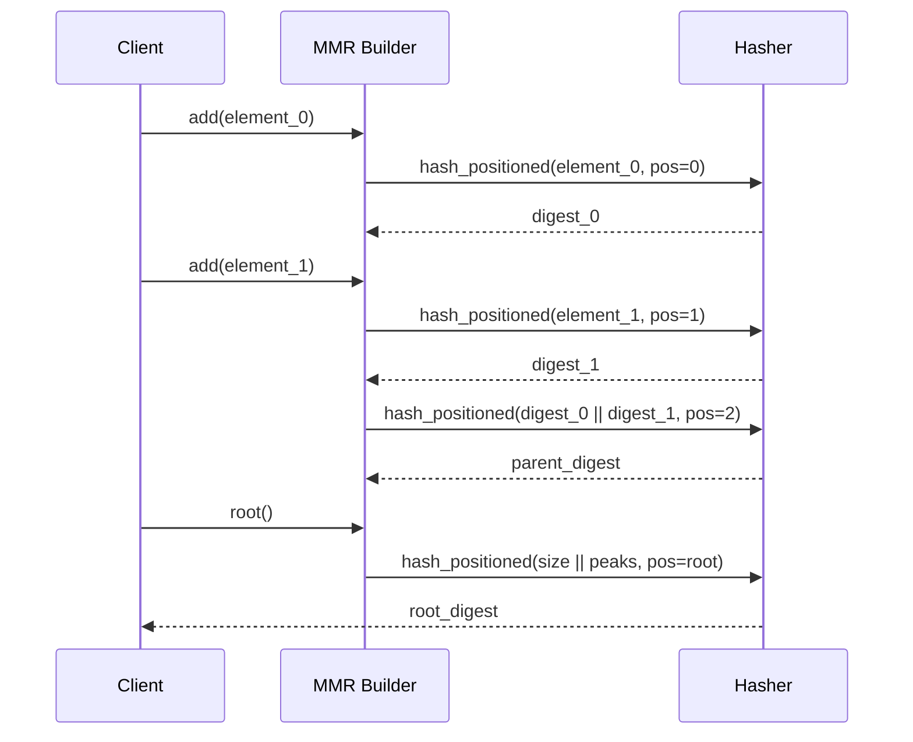
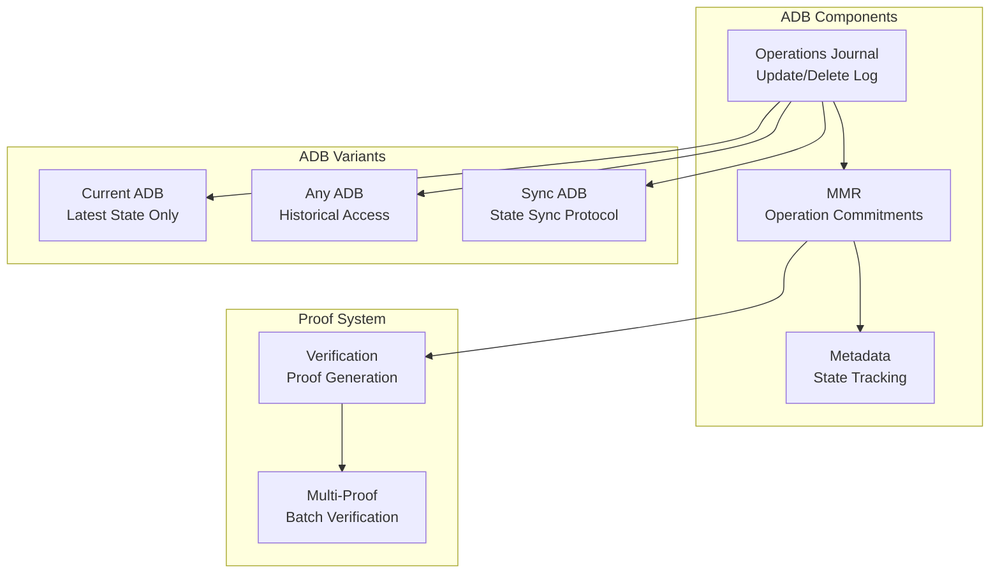
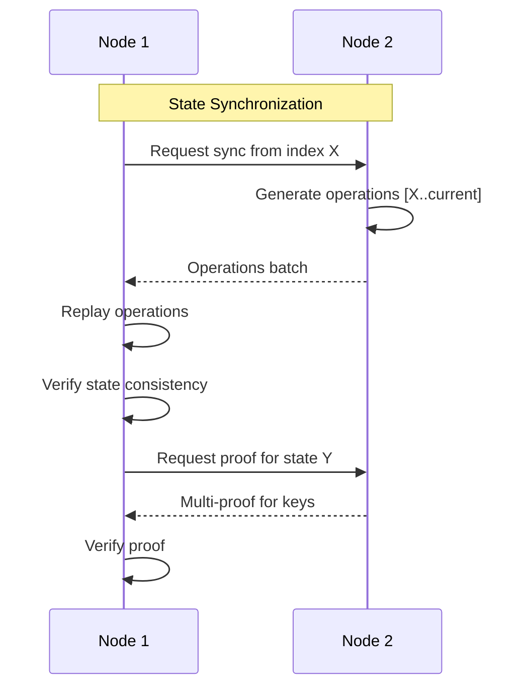
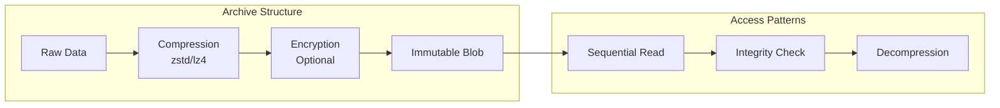
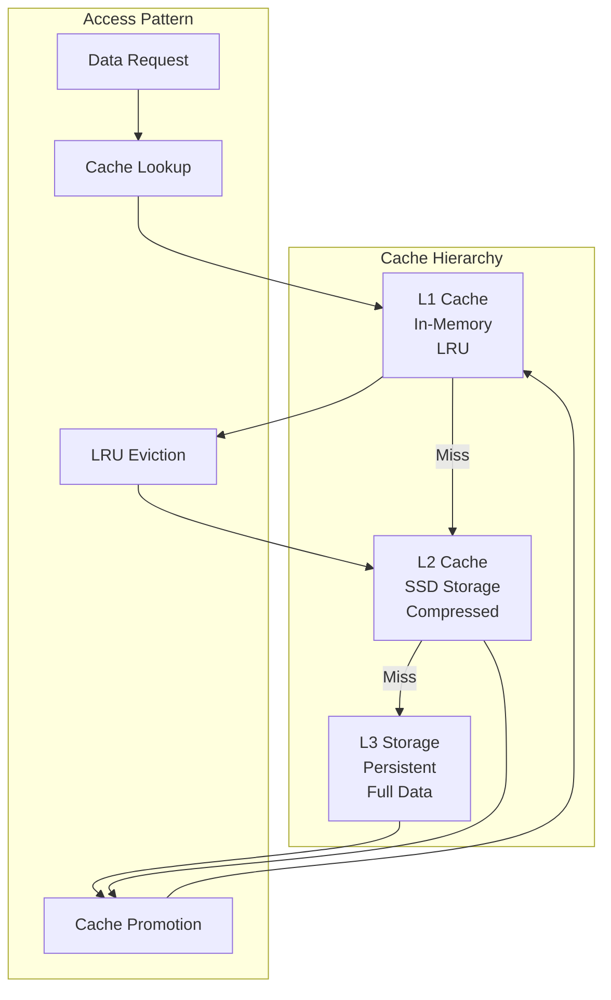
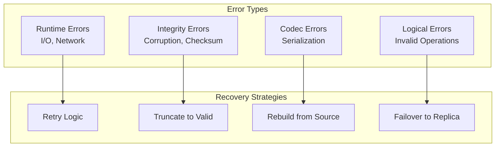

# Storage Module - Technical Documentation

## Overview

The `commonware-storage` module provides persistent data structures and storage abstractions for distributed systems. It offers a comprehensive suite of authenticated databases, journals, and data structures designed for high-performance, crash-safe operation with cryptographic integrity guarantees.

**Key Features:**
- Authenticated Data Broadcast (ADB) protocols
- High-performance append-only journals
- Merkle Mountain Ranges (MMR) for inclusion proofs
- Crash recovery and data integrity
- Compression and encryption support
- Runtime-agnostic design

## Architecture Overview



## Core Components

## 1. Journal System

The journal provides high-performance, append-only logging with crash recovery:



### Fixed Journal

Optimized for fixed-size entries with predictable performance:

```rust
use commonware_storage::journal::fixed::Journal;

// Configuration
let config = Config {
    partition: "consensus".to_string(),
    name: "votes".to_string(),
    entries_per_section: 1000,
    write_buffer_size: NonZeroUsize::new(4096).unwrap(),
    compression: Some(3), // zstd level 3
};

// Initialize
let mut journal = Journal::init(context, config).await?;

// Append operations
let index = journal.append(vote_message).await?;
journal.sync().await?;

// Replay for recovery
let replay_stream = journal.replay(buffer_size).await?;
```

**Key Features:**
- **Predictable Performance**: O(1) append and seek operations
- **Sectioned Storage**: Configurable entries per blob for efficient pruning
- **Integrity**: CRC32 checksums for corruption detection
- **Compression**: Optional zstd compression

### Variable Journal

For variable-size entries with size-efficient storage:

```rust
use commonware_storage::journal::variable::Journal;

// Append variable-size data
let block_data = serialize_block(&block)?;
let index = journal.append(block_data).await?;

// Get specific entry
let recovered_block = journal.get(index).await?;

// Iterate over range
let entries: Vec<_> = journal.iter(start_index, end_index).collect();
```

**Key Features:**
- **Space Efficient**: No padding for variable-size entries
- **Random Access**: Get entries by index
- **Range Queries**: Efficient iteration over ranges

### Journal Storage Layout

```mermaid
graph TD
    subgraph "Journal Structure"
        PARTITION[Partition: "consensus"]
        
        subgraph "Metadata Blob"
            META[metadata.bin<br/>Header + Sections Info]
        end
        
        subgraph "Section Blobs"
            S0[section_0.bin<br/>Entries 0-999]
            S1[section_1.bin<br/>Entries 1000-1999]
            SN[section_N.bin<br/>Entries N*1000...]
        end
    end
    
    PARTITION --> META
    PARTITION --> S0
    PARTITION --> S1
    PARTITION --> SN
    
    META -->|References| S0
    META -->|References| S1
    META -->|References| SN
```

## 2. Merkle Mountain Range (MMR)

MMR provides efficient inclusion proofs for append-only lists:



### MMR Operations

```rust
use commonware_storage::mmr::{Builder, journaled::JournaledMmr};

// Initialize MMR
let mmr = JournaledMmr::init(context, config).await?;

// Add elements
let position = mmr.add(&mut hasher, element_data).await?;

// Get root hash
let root_digest = mmr.root(&mut hasher);

// Create inclusion proof
let proof = mmr.create_proof(&mut hasher, positions).await?;

// Verify proof
let is_valid = verify_proof(root_digest, proof, elements)?;
```

**Key Properties:**
- **Append-Only**: Elements never change position once added
- **Logarithmic Proofs**: O(log n) proof size for inclusion
- **Batch Proofs**: Prove multiple elements efficiently
- **Post-Order Traversal**: Stable node positioning

### MMR Root Calculation



## 3. Authenticated Database (ADB)

ADB provides key-value storage with cryptographic integrity and historical access:

### ADB Architecture



### ADB Operations

**Update Operation**: Sets key to value
```rust
#[derive(Codec)]
struct Update<K, V> {
    key: K,
    value: V,
    commitment: Commitment, // Hash of operation
}
```

**Delete Operation**: Removes key
```rust
#[derive(Codec)]
struct Delete<K> {
    key: K,
    commitment: Commitment,
}
```

### ADB Variants

#### 1. Current ADB

Maintains only the latest state for space efficiency:

```rust
use commonware_storage::adb::current::Adb;

// Initialize
let adb = Adb::init(context, config).await?;

// Apply operations
adb.update(key, value).await?;
adb.delete(key).await?;

// Query current state
let value = adb.get(&key).await?;

// Get root for current state
let root = adb.root().await?;
```

**Features:**
- **Space Efficient**: Only stores latest values
- **Fast Queries**: O(log n) key lookups
- **Compact Proofs**: Minimal proof sizes

#### 2. Any ADB

Provides access to historical states:

```rust
use commonware_storage::adb::any::Adb;

// Query at specific operation index
let historical_value = adb.get_at_index(&key, operation_index).await?;

// Get state root at specific index
let historical_root = adb.root_at_index(operation_index).await?;

// Create proof for historical state
let proof = adb.create_proof_at_index(&keys, operation_index).await?;
```

**Features:**
- **Time Travel**: Access any historical state
- **Historical Proofs**: Prove state at any point in time
- **Audit Trail**: Complete operation history

#### 3. Sync ADB

Optimized for state synchronization between nodes:



### ADB Proof System

#### Creating Proofs

```rust
use commonware_storage::adb::verify::*;

// Single key proof
let proof = create_proof(&adb, &key).await?;

// Multi-key proof
let keys = vec![key1, key2, key3];
let multi_proof = create_multi_proof(&adb, &keys).await?;

// Proof with minimal digests
let proof_store = create_proof_store_from_digests(
    required_digests,
    all_digests
)?;
```

#### Verifying Proofs

```rust
// Verify single proof
let is_valid = verify_proof(root_digest, proof, key, expected_value)?;

// Verify multi-proof
let results = verify_multi_proof(
    root_digest,
    multi_proof,
    key_value_pairs
)?;

// Extract required digests for verification
let required = digests_required_for_proof(&keys, operation_count)?;
```

## 4. Advanced Storage Structures

### Archive

Compressed, immutable storage for historical data:



### Freezer

Immutable storage with content addressing:

```rust
use commonware_storage::freezer::Freezer;

// Store immutable data
let content_hash = freezer.store(data).await?;

// Retrieve by content hash
let retrieved_data = freezer.get(&content_hash).await?;

// Verify integrity
assert_eq!(hash(&retrieved_data), content_hash);
```

### Cache

Multi-level caching for hot data:



## Testing & Determinism

### Deterministic Storage Testing

All storage components work with the deterministic runtime for reproducible testing:

```rust
#[test]
fn test_journal_crash_recovery() {
    let runner = deterministic::Runner::seeded(42);
    runner.start(|context| async move {
        // Write data
        let mut journal = Journal::init(context.clone(), config).await?;
        journal.append(data).await?;
        
        // Simulate crash (don't call close)
        drop(journal);
        
        // Recovery
        let journal = Journal::init(context, config).await?;
        let recovered_data = journal.get(0).await?;
        assert_eq!(recovered_data, data);
    });
}
```

### Corruption Testing

```rust
#[test]
fn test_corruption_recovery() {
    let runner = deterministic::Runner::seeded(123);
    runner.start(|context| async move {
        // Write valid data
        let mut journal = Journal::init(context.clone(), config).await?;
        journal.append(valid_data).await?;
        journal.close().await?;
        
        // Corrupt the blob
        let (blob, _) = context.open(&partition, &blob_name).await?;
        blob.write_at(vec![0xFF; 100], 50).await?; // Corrupt middle
        blob.sync().await?;
        
        // Verify recovery behavior
        let result = Journal::init(context, config).await;
        match result {
            Ok(journal) => {
                // Should truncate to last valid entry
                assert!(journal.size().await? < original_size);
            }
            Err(Error::ChecksumMismatch(..)) => {
                // Expected corruption detection
            }
        }
    });
}
```

### Fuzz Testing

The storage module includes comprehensive fuzz testing:

```rust
// Fuzz targets available:
// - journal_operations: Random journal operations
// - adb_operations: ADB update/delete sequences  
// - mmr_operations: MMR add/proof operations
// - archive_operations: Archive compress/decompress
// - bmt_operations: Binary Merkle Tree operations
```

## Performance Characteristics

### Journal Performance

| Operation | Fixed Journal | Variable Journal |
|-----------|---------------|------------------|
| Append | O(1) | O(1) |
| Get by Index | O(1) | O(1) |
| Sequential Read | O(n) | O(n) |
| Sync | O(1) | O(1) |
| Compression | ~50-80% reduction | ~30-70% reduction |

### ADB Performance

| Operation | Current ADB | Any ADB |
|-----------|-------------|---------|
| Update/Delete | O(log n) | O(log n) |
| Get (latest) | O(log n) | O(log n) |
| Get (historical) | N/A | O(log n) |
| Proof Generation | O(k log n) | O(k log n) |
| State Sync | O(m) | O(m) |

Where:
- n = number of operations
- k = number of keys in proof
- m = operations to sync

### MMR Performance

```mermaid
graph LR
    subgraph "Scalability"
        SIZE[Tree Size]
        PROOF[Proof Size]
        VERIFY[Verify Time]
    end
    
    SIZE -->|1M elements| PROOF
    PROOF -->|~20 hashes| VERIFY
    VERIFY -->|O(log n)| RESULT[Logarithmic Scale]
    
    SIZE -->|1B elements| PROOF2[~30 hashes]
    PROOF2 --> VERIFY2[Still O(log n)]
```

## Configuration

### Journal Configuration

```rust
use commonware_storage::journal::fixed::Config;

let config = Config {
    partition: "consensus".to_string(),
    name: "operations".to_string(),
    entries_per_section: 10000,        // Entries per blob
    write_buffer_size: NonZeroUsize::new(64 * 1024).unwrap(), // 64KB
    compression: Some(3),               // zstd level 3
    buffer_pool: pool_ref,              // Shared buffer pool
};
```

### ADB Configuration

```rust
use commonware_storage::adb::current::Config;

let config = Config {
    operations: journal_config,         // Operations journal
    mmr: mmr_config,                   // MMR for commitments
    metadata: metadata_config,          // State metadata
    cache_size: 1000,                  // In-memory cache
};
```

### Storage Tuning

#### For High Throughput
```rust
Config {
    entries_per_section: 100000,       // Larger sections
    write_buffer_size: NonZeroUsize::new(1024 * 1024).unwrap(), // 1MB
    compression: None,                  // Disable compression
}
```

#### For Space Efficiency
```rust
Config {
    entries_per_section: 1000,         // Smaller sections
    write_buffer_size: NonZeroUsize::new(4096).unwrap(), // 4KB
    compression: Some(9),               // Maximum compression
}
```

#### For Low Latency
```rust
Config {
    entries_per_section: 10000,        // Moderate sections
    write_buffer_size: NonZeroUsize::new(32768).unwrap(), // 32KB
    compression: Some(1),               // Fast compression
}
```

## Error Handling & Recovery

### Error Categories



### Recovery Patterns

#### Journal Recovery
```rust
match Journal::init(context, config).await {
    Ok(journal) => {
        // Normal initialization
        journal
    }
    Err(Error::ChecksumMismatch(expected, actual)) => {
        // Corruption detected - truncate to last valid
        warn!("Corruption detected, truncating journal");
        let journal = Journal::recover_with_truncation(context, config).await?;
        journal
    }
    Err(Error::InvalidBlobSize(..)) => {
        // Size mismatch - rebuild from operations
        warn!("Size mismatch, rebuilding journal");
        let journal = Journal::rebuild_from_operations(context, config).await?;
        journal
    }
}
```

#### ADB Recovery
```rust
match Adb::init(context, config).await {
    Ok(adb) => adb,
    Err(Error::OperationPruned(index)) => {
        // Historical data unavailable - sync from peers
        let adb = Adb::init_with_sync(context, config, sync_source).await?;
        adb
    }
    Err(Error::Mmr(mmr_error)) => {
        // MMR corruption - rebuild from operations
        let adb = Adb::rebuild_mmr(context, config).await?;
        adb
    }
}
```

## Integration Examples

### Consensus Integration

```rust
// Journal for consensus operations
let consensus_journal = Journal::init(
    context.clone(),
    Config {
        partition: "consensus".to_string(),
        name: format!("node_{}", node_id),
        entries_per_section: 10000,
        compression: Some(3),
        ..Default::default()
    }
).await?;

// ADB for state management
let state_adb = Adb::init(
    context.clone(),
    Config {
        operations: journal_config,
        mmr: mmr_config,
        metadata: metadata_config,
        cache_size: 10000,
    }
).await?;
```

### Blockchain Integration

```rust
// MMR for block commitments
let block_mmr = JournaledMmr::init(
    context.clone(),
    Config {
        partition: "blockchain".to_string(),
        name: "blocks".to_string(),
        hasher_config: Blake3Config::default(),
    }
).await?;

// Add block to MMR
let block_position = block_mmr.add(
    &mut hasher,
    &block.serialize()
).await?;

// Create inclusion proof
let proof = block_mmr.create_proof(
    &mut hasher,
    vec![block_position]
).await?;
```

## Best Practices

### 1. Partition Design
- Use descriptive partition names
- Separate different data types
- Consider access patterns for partitioning

### 2. Section Sizing
- Balance between I/O efficiency and memory usage
- Larger sections for sequential access
- Smaller sections for random access

### 3. Compression Strategy
- Use compression for cold data
- Disable for hot, frequently accessed data
- Profile different compression levels

### 4. Error Handling
- Always handle corruption gracefully
- Implement proper retry logic
- Log errors for debugging

### 5. Testing
- Use deterministic runtime for reproducible tests
- Test corruption scenarios
- Validate recovery procedures

### 6. Monitoring
- Track storage metrics (size, operations/sec)
- Monitor error rates
- Alert on corruption events

## Future Enhancements

- **Encryption at Rest**: Transparent encryption for sensitive data
- **Replication**: Built-in replication for high availability
- **Compression Algorithms**: Additional compression options
- **Concurrent Access**: Multi-reader, single-writer patterns
- **Cloud Storage**: Support for cloud blob stores
- **Query Optimization**: Advanced indexing and query planning

## Conclusion

The storage module provides a comprehensive foundation for persistent data in distributed systems:

1. **High Performance**: Optimized data structures and I/O patterns
2. **Integrity Guarantees**: Cryptographic authentication and corruption detection  
3. **Crash Safety**: Robust recovery mechanisms
4. **Flexibility**: Multiple storage patterns and configurations
5. **Testing Support**: Deterministic operation for comprehensive testing

The combination of journals, MMRs, and ADBs provides the necessary primitives for building robust, high-performance distributed systems with strong consistency and integrity guarantees.